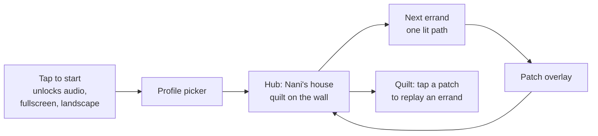

# Nani jo Ghar — Roadmap and Story Structure

*Decisions and direction agreed on 23 Sep 2026, after two playtests of the fruit-bowl errand on a phone and a laptop, and the same day's game-mode, story-arc and syllabus work. Companion to the Brief, Game Design and Technical Plan. Where this doc and the Game Design doc disagree, this doc is newer. The full playtest findings live in "Nani jo Ghar playtest review, 23 Sept 2026" in the repo; the rules from it are summarised in "Lessons" below.*

## Where we are

The fruit-bowl errand (`bowl-01`) has been rebuilt in Phaser and playtested twice. It is unpolished, but it proves the concept: the core loop works, the foreground basket works, characters behind counters work, quantities work, and it plays on six screen sizes including 16:10 laptops. The pedagogy, game modes, story arcs and syllabus framework are drafted (below). What's left is filling that framework with real language, and turning one proven errand into a production-quality game.

**Current working documents:** Questions for Mum (Round 1) for the language workstream; Chapter 1 Art Prompts for the art workstream; Build Brief v4 (production Shopping + thin shell) for phase 2.

## Setting

**Nani's house is in Kutch**, not the UK. Confirmed 23 Sep 2026. The monsoon is a real Kutch monsoon, and the village/farm arc is Nani's own home, not a "trip back" from abroad.

## Workstreams

Four workstreams, mostly running in parallel.

| Workstream | What it produces | Depends on | Status |
| --- | --- | --- | --- |
| **A. Language** | Mum's answers (Questions for Mum, Round 1), then the ~400-word list and content master | Nothing; runs alone | Questions ready to send |
| **B. Art and scene specs** | Layout contract v2 (below), backgrounds, characters, carried containers | Design decisions only; images can precede confirmed words | Chapter 1 prompts written; Nani animation (LivePortrait) underway |
| **C. Game modes** | Production Shopping, then Cook-along and Put it there, then the rest | B for scenes; A for real words (placeholders fine meanwhile) | Build Brief v4 written |
| **D. Game shell** | Profiles, saving, hub, quilt, settings (thin shell spec below) | Nothing | In Build Brief v4 |

## Phase sequence

| Phase | What happens | What it proves |
| --- | --- | --- |
| **0. Now, in parallel** | Send Mum the questions. Finish the LivePortrait face frames for Nani | The character pipeline holds up |
| **1. Lock Chapter 1's scene spec** | Run the basket angle test (Build Brief v4, section 1), then generate the Chapter 1 art: kitchen v3, bazaar stall v3, spice cupboard, sitting room with dastarkhwan, containers, tableware, Eid decorations | The art direction is settled before more is built on it |
| **2. Production Shopping + thin shell** | Build Brief v4: fruit-bowl errand polished end to end, with profiles, saving, hub and story beats | One errand is genuinely shippable |
| **3. Finish Chapter 1** | Cook-along (Daal for dinner) and Put it there (Set the dastarkhwan), first quilt patch | The core loop across three modes and a real story. **Family play-test here** |
| **4. Spec all Arc 1 scenes, then batch the art** | Write every remaining Arc 1 scene spec in one pass (each drawn around its mode's needs: hide spots, doorway, clothes stall), then generate backgrounds and characters together | Style consistency; "scenes are data" |
| **5. Remaining Arc 1 modes, one per chapter** | At the door, Hide and seek, Ask around, Get dressed | Each mode is a template, not a one-off |
| **6. Recordings, polish, store wrap** | Family audio in, quilt finished, App Store and Google Play submission | The MVP |

**Spec early, generate late.** All Arc 1 scenes get specified in phase 4, but not generated until Chapter 1 has tested the layout contract in real play, so a batch doesn't need regenerating.

**The real gate** is still the Brief's: the first recording session with Zafar's mother being a good evening. It naturally falls between phases 2 and 3, once Chapter 1's words are confirmed.

## Layout contract v2

Supersedes the layout contract in the Image Prompt Sheets doc and the "Screen layout" section of the Game Design doc. Drawn from the two 23 Sep playtests. Every scene follows it, so the interface and code never change between scenes.

### The world and the screen

| Rule | Detail |
| --- | --- |
| World size | Fixed 1600×900 (16:9), scaled to fit. All positions are background pixels, stored in `data/scenes/<scene>.json` and checked with `build/place_preview.py` |
| Sidebar | Always its own column beside the game in landscape, never on top of it. A slide-out drawer only in portrait or on very narrow screens, with a close button, and it never opens by itself during play |
| Letterbox | Filled with the scene's dominant colour or a blurred copy of the background, never black bars |
| Tests | Every build tested at phone landscape (915×375), 1366×768, **1440×900 and 1280×800 (16:10)**, and iPad landscape and portrait. Before every tap, the test checks nothing covers the item |

### Depth layers, back to front

1. Background (painted wall, shelves, sky)
2. Swaying scenery layer, where supplied (curtain, awning, lantern, hanging pots) [later]
3. Character (upper body only)
4. **Counter, island or bolster front**, which hides the character's lower body. Drawn into the background or supplied as a matching separate layer
5. Items on shelves and counters, each with a contact shadow, sunk ~4px into the surface
6. Destination container where one exists (Nani's bowl, the cooking pot: back layer, items, front rim)
7. **Carried container** (the player's basket or tray: back layer, items, front rim)
8. Anything in flight; speech bubbles; overlays

### The carried container (core mechanic)

- Bottom-centre of the screen, **no taller than 22% of the screen height**, so it works on a 375px-tall phone.
- A separate art layer, never painted into a background, so one background works with a basket, a tray, a notebook or a sewing box.
- Three layers: inside back, items, front rim. Items pack into preset spots, turned ±8°, overlapping like a real basket.
- Everything collected is visible where it goes. No invisible counters.
- Chapter 1: the shopping basket (Errand 1) and the serving tray (Errand 3). Later: notebook (Ask around), sewing kit (thread quest), first-aid box (Monsoon).
- Tap to move, never drag.

### Characters

- Always stand behind a counter, island or bolster; hidden by the scene, never by the screen edge.
- Upper body only, so no legs and rarely arms are needed.
- Every pose on an identical canvas size and position. Eyes and mouth are the only parts that change for frequent animation (blinks, talking); see the character animation approach in the playtest review.
- Speaking uses a speech bubble from the speaker: solid cream background, dark text, English one tap away inside the bubble. Replaces the caption band across the top.

### Item zones: sized by what the zone is for

| Zone | What it is | Sized by | Capacity |
| --- | --- | --- | --- |
| **Shop display** (bazaar counter) | Targets plus decoys for one errand; restocked by the errand generator each time | The largest single errand: up to 6 targets plus a similar number of look-alike decoys | **10 to 12 slots** in one row on the counter, with crates and baskets as holders |
| **Pantry** (kitchen shelves) | A progress container: every mastered food word lives here for good | The whole food vocabulary it holds | **4 long, evenly spaced shelves, room for ~32 items** (16 fruit, 16 vegetables), slots built into the art |
| **Spice cupboard** | A separate close-up scene opened from the kitchen | The spice vocabulary | **3 shelves × 6 = 18 slots** for the 16 spices |
| **Dastarkhwan** | The "put it there" surface for laying the table | One meal for the family and guests | Hotspots measured onto the cloth: places, cups, serving dishes |

The spice cupboard is in the MVP because Chapter 1's daal needs spices. Buying spices at a separate spice seller is deferred: in Chapter 1 the spices are already in Nani's cupboard.

### Background art brief (every new background)

- A counter, island or bolster running across the scene, with room behind it for the character. No leftover floor objects (rugs, crates) where it goes or in the foreground.
- A slightly high camera looking down onto the work surface, so items and containers read clearly.
- Clear, flat, evenly lit surfaces where tappable items go. **No painted food anywhere near a tappable zone.**
- The quiet left strip is no longer needed for the sidebar (it has its own column), but keep the far edges uncluttered for the 4:3 crop.
- Same camera height and painterly lighting in every scene, 16:9, no text.
- Supply separately, on transparent backgrounds, in the same style: carried container, destination container, counter front layer, swaying items.

### Sidebar (the recipe list)

- Each row: `[quantity ×] [Kutchi word] [play button, never clipped]`, dots that fill as items are collected (● ● ○), English toggle beneath. Items with no count show no number.
- Buttons hidden until usable, never shown greyed-out as "…".
- Later: the list moves into the world (a handwritten list tied to the basket handle), freeing the whole screen.

## Thin shell spec

The per-word difficulty model is saved state, so saving belongs in phase 2 alongside production Shopping, not at the end. Everything stays on the device. Build details are in Build Brief v4.

### Launch flow

### MVP scope

| Item | Behaviour |
| --- | --- |
| **Tap to start** | Kept from the current build: unlocks audio, requests fullscreen and landscape lock |
| **Profile picker** | Up to 6 profiles on a device, each a large avatar tile with a name. "+" to add |
| **Create profile** | Name (typed by an adult), avatar from a set of ~8 illustrations, and two toggles set by the adult: "Can read" (reads) and "Can type" (writes). Neither is a difficulty setting |
| **Hub** | Nani's kitchen with the quilt on the wall, Eid decorations that accumulate as errands are finished, and one clearly lit "Nani needs you" button to the next errand. No map yet |
| **Replay** | Tapping a quilt patch replays that errand, per the Game Design doc |
| **Leave an errand** | A home tab on the sidebar rail, with a one-tap confirm. Word progress already earned is kept; the errand restarts from its beginning next time |
| **Settings** (behind an adult hold, press for 3 seconds) | Volume, rename or delete a profile, reset a profile's progress |

### What gets saved, and when

| Data | Saved when | Notes |
| --- | --- | --- |
| Profile (name, avatar, reads, writes) | On create or edit | |
| PlayerWordProgress (understand_stage, produce_stage, last_seen, recent misses) | Every time a word's stage changes | The difficulty model; never lost mid-errand |
| Completed errands, earned patches, hub decorations | At the patch overlay | Drives the hub's lit path, the quilt and the dressing |
| Last errand in progress | At each phase boundary (intro, shop, home) | MVP resumes at the start of that errand, not mid-phase |
| Settings | On change | |

### Storage rules

- IndexedDB through one small storage module, one record per profile, every record carrying a `schema_version` so later versions can migrate old saves.
- Call `navigator.storage.persist()` on first profile creation to ask the browser not to clear the data.
- iPhone Safari may clear stored data for a web page that goes unused for a while unless it has been added to the home screen. Family testing therefore uses the home-screen install, and the Capacitor wrap removes the issue for the store versions. Verify this behaviour at build time.
- If storage is unavailable (for example a private browsing window), the game still plays, with a gentle notice that progress won't be kept.
- Nothing is uploaded, synced or exported off the device. No accounts, no analytics.

### Later (not in the thin shell)

First-run onboarding, a map once there are more places, Grandparent mode entry (with At the door), whose-voice setting, offline caching via a service worker, the privacy policy, store packaging.

## Story structure: the levels of granularity

| Level | What it is | Example | Progress object |
|---|---|---|---|
| **Story** (arc) | A whole season with a finale | *Eid at Nani's*: the family gathers, there's food, a mishap, a party, the mosque on Eid morning | Finishing it completes a quilt |
| **Chapter** | One event in the story with its own goal, complication and payoff | *The guests are coming*, then *Knock knock* | One quilt patch per chapter |
| **Errand** | One play session, 5–8 minutes. This is "the level" | *Fruit bowl for the guests*, *Daal for dinner*, *Set the dastarkhwan* | Words mastered go into their container |
| **Game mode** | A reusable mechanic that errands are built from | Shopping, put-it-there, hide and seek, cook-along, at-the-door, ask-around, spot-it, body/dress | None of its own, see Game modes below |
| **Container** | A long-running collection that fills as words are mastered | Nani's pantry (food), the spice cupboard, the sewing kit (colours/threads), the wardrobe (clothes) | Is the progress |

**Two kinds of progress, deliberately split:** containers track **words** (a mastered word stays on the shelf for good), the quilt tracks **story** (one patch per chapter).

**Learning tree:** each domain has its own levels (Kitchen 1–5, Sewing 1–5, Wardrobe 1–5, Family 1–5), driven by the per-word stages of the words in it. Long term: the player composes their own recipe from ingredients they know, and later says what they like to eat.

**Storytelling principles:** alternate pace (calm kitchen, busy bazaar, curiosity, mild tension); every chapter has a goal, a complication and a payoff; each chapter opens a place and fills a container; recurring characters carried across every arc; events cause the next errand rather than errands being handed out; **consecutive errands never repeat the same main action**, so each one feels like a new thing to do.

**Cost to keep in mind:** each story event needs a background, characters, and recorded sentences. The family's recording time is the real limit on pace, so the story reuses places and characters heavily.

## How the story is told

Many players can't read, and the Brief rules out cutscenes, so the story is carried by **what you see and hear, never by text you must read.** Understanding the story is a bonus; the task itself never depends on it.

### Three channels, in order of importance

| Channel | What it carries | Who it reaches |
| --- | --- | --- |
| **Picture and action** | What changes in the world: a lantern goes up, the empty bowl on the island, the pot on the stove, the guests' shoes piling up by the door. Nani points and gestures | Everyone, including a four-year-old |
| **Sound** | Nani's voice in Kutchi, a knock at the door, a bubbling pot, market chatter | Everyone; the Kutchi is the teaching |
| **Text** | A short English gist caption ("Eid is tomorrow and the guests are coming!") and the Kutchi subtitle, in the speech bubble | Readers only, and the adult sitting with a child |

### Story beats

Each errand opens and closes with a **beat**: 3 to 5 seconds, one visual moment, one Kutchi line from Nani, one gist caption. Skippable with a tap, skipped automatically on replay. It's a moment inside the scene, not a cutscene: the player is already in the kitchen, and Nani does something.

Story lines are recorded like any other sentence. Until the family has given the Kutchi, a beat shows the gist caption only, with no audio. Never invented Kutchi.

### The hub fills up with Eid

The kitchen is the hub, and it **changes as the story moves**: a lantern after the first errand, bunting after the second, lights and the laid dastarkhwan after the third, then the quilt patch. A returning player sees at a glance where they are in the story without reading anything. This is the cozy-game principle: progress shows up as a changed place.

### Chapter 1 beat script

| Moment | What you see | Nani says (Kutchi, from the family) | Gist caption |
| --- | --- | --- | --- |
| Errand 1 intro | Nani hangs a lantern, then points at the empty bowl on the island | [needs family] | Eid is tomorrow and the guests are coming tonight! |
| Errand 1 outro | The full bowl glows; Nani pats the stove | [needs family] | The fruit is ready. Now help me cook dinner. |
| Errand 2 intro | A pot on the stove, pantry gaps pulse | [needs family] | Let's make daal. |
| Errand 2 outro | Steam rises; Nani tastes and smiles, then points to the next room | [needs family] | Delicious! Now let's lay the dastarkhwan. |
| Errand 3 intro | The empty cloth; Nani hands you the tray | [needs family] | Plates first, then the cups. |
| Errand 3 outro and chapter end | Everything laid; lights come on; a knock at the door, Nani turns to it | [needs family] | They're here! |

The knock is the hook into Chapter 2 (Knock knock), so the chapter ends on a question rather than a full stop.

## Design research behind the game modes

| Principle | Finding | Test it gives us |
| --- | --- | --- |
| **Intrinsic integration** | Habgood and Ainsworth found educational games work best when the learning material is delivered through the parts of the game that are most fun to play, riding the flow experience rather than interrupting it; the opposite, chocolate-covered broccoli, uses the game as a reward for doing the learning separately | Could the player win without understanding any Kutchi? If yes, the mechanic teaches nothing and gets cut |
| **Total Physical Response** | Learners first work out commands by watching, then act out novel combinations of already-known words; comprehension comes well before production | Does the mechanic recombine known words into new commands? |
| **Task-based teaching** | TBLT centres on tasks with a non-linguistic outcome where using the language is essential to reaching it | Is there a real goal (a fruit bowl, a found ring) that only Kutchi unlocks? |
| **Narrative load** | Following a story can consume the cognitive capacity needed to learn the material, with young children most at risk | Is the story carried by actions and objects, or by text the child has to read? |
| **Cozy-game progression** | Animal Crossing's progression is relational and environmental; Wylde Flowers adds chapters, character arcs and a central mystery on top of that loop | Does progress show up as a changed place and a closer relationship? |

Sources: Habgood & Ainsworth, *Motivating children to learn effectively* (2011); *Total physical response* (Wikipedia); Breien & Wasson, *Narrative categorization in digital game-based learning* (2021); *The Cozy-Game Craft of Animal Crossing: New Horizons* (2025).

## Game modes

A game mode is code, built once. A scene is a background plus its tagged hotspots (new art plus a scene JSON, no new code). An errand is a spreadsheet row choosing a mode, a scene, a word list and a story line. "Hide and seek under the sofa" and "hide and seek in the first-aid box" are the same mode on different scenes.

| # | Mode | Player hears / does | Language it trains | Where it's used |
| --- | --- | --- | --- | --- |
| 1 | **Shopping** (built) | Seller asks what and how many; tap once per unit; it goes into your basket | Nouns, numbers, quantity phrases | Bazaar, gift stall, craft stall |
| 2 | **Put it there** | "Put the plates on the mat, the cups next to them"; tap the item, then the spot | Postpositions, imperatives, colours as sorting | Dastarkhwan, shoe sorting, sweet box, mehndi pattern, family photo |
| 3 | **Hide and seek** | Someone says where they saw it; look there, the cat is often to blame | Postpositions, household nouns, past tense (heard) | The ring, the chicks, the sweets, the medicine kit |
| 4 | **Cook-along** | Nani gives steps in order: wash, cut, add, stir | Action verbs, sequence words, taste adjectives | Daal, chai, farm lunch |
| 5 | **At the door** | Someone arrives; Nani prompts; pick a reply by tapping to hear each; the visitor reacts | Greetings, kinship, politeness; home of Grandparent mode | Greeting guests, Eidi, clinic check-in |
| 6 | **Ask around** | Visit relatives, ask a question, answers write into the notebook | Questions, kinship, likes, recall by reading back | Thread quest, wedding invitations, Nana's stories |
| 7 | **Spot it** | Nani names things as they appear; tap them in time | Nature, weather, describing people | Sky watch, the journey, old photos |
| 8 | **Where it hurts / get dressed** | Tap or dress the body part or item of clothing named | Body parts, clothing, feelings | Symptom check, Eid dressing, wedding outfits |

**Pressure** is always the upside version: be quick and Nani is extra pleased. Nothing floods, breaks or punishes. A "toy interlude" (dhol drumming, churning butter, block-printing) can sit between errands as a 20-second breather, never as a gate.

## Recurring cast

| Character | Trait | What it's for |
| --- | --- | --- |
| Nani | Warm, says "Arre re!" on a miss | The instruction-giver; her fixed frames are the grammar backbone |
| The cat | Steals and hides things | Runs every Hide and seek errand; a running gag, no peril, endless postpositions |
| Nana | Dozes, tells stories | The past-tense narrator, arrives in the Village arc |
| Older cousin | Always losing things, eventually asks the player to explain | Role reversal: the player gives the instruction |
| The shopkeeper | Sometimes hands over the wrong thing | The player's first taste of correcting someone in Kutchi |

## Story arcs

Five arcs, ordered as a grammar ladder (see Syllabus), about five chapters each, two or three errands per chapter, roughly 50 errands in total.

### Arc 1: Eid at Nani's (the MVP, syllabus stages S1 + S2)

Confirmed 23 Sep 2026: every Chapter 1 errand has a different main action, in the order a real evening goes (buy, cook, lay the table), so a new player's first impression is three different things to do, not one thing twice.

| Chapter | Goal → complication → payoff | Errands (mode) |
| --- | --- | --- |
| The guests are coming | Guests tonight → nothing's ready → fruit out, dinner cooked, table laid, knock at the door | 1. Fruit bowl (Shopping, then fill the bowl). 2. Daal for dinner (Cook-along, from the pantry and spice cupboard). 3. Set the dastarkhwan (Put it there) |
| Knock knock | Welcome everyone → shoes everywhere → mat is tidy | Greeting the guests (At the door), Shoe mountain left/right (Put it there) |
| The cat and the sweets | Serve the mithai → the cat scatters them → box repacked | Find the sweets (Hide and seek), Repack the sweet box (Put it there, with counting) |
| The spill | Pour sharbat → it goes on a guest's kurta → a new kurta | Clothes stall (Shopping), Thread for the tailor (Ask around) |
| Eid morning | Get ready → greet the elders → Eidi, party, quilt complete | Dressing (Body/dress), Eid greetings (At the door) |

Chapter 1 therefore needs three modes (Shopping, Cook-along, Put it there) before the family play-test at phase 3.

### Arc 2: The Wedding (S3)

Placed second because kinship, colours and adjectives are exactly S3's content, and the thread/blanket quest slots in as the gift chapter.

| Chapter | Beat | Errands |
| --- | --- | --- |
| The invitation | Who's getting married, and who's who to them? | Ask around (kinship) |
| Outfits | Everyone needs something | Clothes and bangles (Shopping), Dress up (Body/dress) |
| Mehndi night | A flower on the left hand, dots on the right | Place the pattern (Put it there), dhol toy interlude |
| The gift (the thread/blanket quest) | Ask each relative their favourite colour, buy the threads, Nani asks for each colour back | Ask around, Shopping |
| The feast | Serve guests in the order they arrived, as they like it | Put it there |

### Arc 3: The Monsoon (S4)

A real Kutch monsoon. Illness replaces the original "Nani slips" idea: gentler, same body and feelings words.

| Chapter | Beat | Errands |
| --- | --- | --- |
| Clouds coming | Washing's out, the sky changes | Watch the sky (Spot it), bring it inside (Put it there) |
| The leak | Drips everywhere, comically, never actually flooding | Buckets under the drips (Put it there) |
| The animals | Goats and hens caught outside; chicks hide indoors | Into the shed (Put it there), find the chicks (Hide and seek) |
| Nani has a cold | Say what hurts, fetch the medicine | Where does it hurt (Body/dress), the clinic (Shopping) |
| Chai together | The payoff | Make chai (Cook-along) |

### Arc 4: Nani's Lost Ring (S5)

The mystery is the past tense: "who saw it, what were you doing?"

| Chapter | Beat | Errands |
| --- | --- | --- |
| It's gone | Nani says where she last had it | Search the dressing table (Hide and seek) |
| Who saw it? | Each relative says what they were doing | Ask around |
| Following clues | Jars, quilts, the sofa: funny lost objects turn up | Search the house (Hide and seek) |
| Footprints | Big prints, small prints: the cat's, or a person's? | Follow the trail (Spot it) |
| The crow | The ring is in a nest; trade the crow something shiny | Trade (Shopping), Nani tells the ring's story (short, skippable, Kutchi with captions) |

### Arc 5: Nani's Village (S6, the finale)

Nani's own village in Kutch. Folds in the farm and family-tree ideas.

| Chapter | Beat | Errands |
| --- | --- | --- |
| The old trunk | Old photos: who's who, young and old | Match the face (Spot it) |
| The journey | Things spotted on the road | Spot it |
| The farm | Mangoes up, groundnuts down, lunch | Pick and dig (Put it there), farm lunch (Cook-along) |
| Nana's stories | Listen, then put the pictures in order | Ask around |
| The family photo | Arrange everyone: next to, behind, in front, tallest | Put it there, a full recap of kinship and position |

**Folded rather than dropped from the original brainstorm:** the clinic sits inside the Monsoon; the kitchen workshop is spread across every arc via Cook-along; the craft fair becomes the Wedding's gift chapter; the farm and family tree become the Village. School is cut: it sits outside Nani's world, and its core ideas (script tracing, rhymes) are non-goals.

## MVP and release scope

**Arc 1, Eid at Nani's, finished end to end, is the first release candidate.** If it lands well (a child in the family asks to play it again unprompted, and the recording sessions stay a good evening for Zafar's mother), Arc 2 onward gets built the same way. Each later arc should be faster to build, because the modes, the chunked-recording pipeline and the errand generator all exist by then; only new backgrounds, words and story beats are new work.

## Learning design decisions

- **New words per errand scales with pace, not with a level.** Three new words per errand to start; a player whose words reach produce stage quickly is offered up to five or six. Still per word, never labelled easy or hard.
- **Pre-exposure:** at the bowl/pot step, Nani names things she has already added so the next errand's words are heard before they're taught.
- **Recipes are the unit of an errand**, tied to story events. Mixed categories (fruit + veg + spice) aid discrimination.
- **Errand lists are generated**: words due for review plus new words, decoys chosen to look alike. (Hand-written for the fruit bowl only.)
- **The shopping list shows Kutchi (romanised) plus a play button**, never a picture and never English. English is one tap away.
- **Quantities are shown and heard.** The list shows "2 × santra" with dots that fill in; Nani says the plural sentence when the quantity is more than 1. *Supersedes the earlier "no digits on the list" decision, after playtest 1 showed players couldn't tell how many to buy.*
- **Pantry gaps are the item's outline shape**, pulsing as Nani names it, on first meeting only.
- **Glow is a hint, not a giveaway:** only after a wrong tap or ~5 seconds of hesitation.
- **A word advances a stage on correct recall from the Kutchi**, not on being seen. Two misses drop it a stage.
- **The recipe list looks like a paper recipe card**, with Kutchi written over it; later it moves into the world.

## Skill channels: listening, reading, speaking, writing

| Skill | Role | How it's checked | Constraint |
| --- | --- | --- | --- |
| Listening | The core; every errand runs on it | Act on it, the task is the test | None |
| Reading | Optional helper, romanised only | Read the list, tap the item | Gated by the profile's reads flag |
| Speaking | The real goal for adults | Record and compare; Grandparent mode; later the eight-word classifier | No Kutchi speech recognition exists |
| Writing | Adults and older children only | Typed romanised, matched generously | Gated by the profile's writes flag; no handwriting |

The channel is chosen per word, inside ordinary play, by that word's own stage:

| Rung | Player gets | Player does | Unlocks when |
| --- | --- | --- | --- |
| 1 | Audio + picture + hint glow | Tap | First meeting |
| 2 | Audio, help fading | Tap | understand_stage 2 to 3 |
| 3 | Romanised text only | Tap | understand_stage 3+, reads profile only |
| 4 | Picture only | Say it (role reversal: player is the shopkeeper) | produce_stage 3+ |
| 5 | Audio | Type it (notebook, thread quest) | produce_stage 3+, writes profile only |
| 6 | A question in context | Answer aloud | produce_stage 5, Grandparent mode now, classifier later |

**The word's stage** decides the channel and support; **the story arc** decides how complex the sentences around it are.

## Procedural generation and the errand pipeline

Once a mode's first errand is built well, later errands in that mode are generated: pick due and new words, pick hotspots and decoys, assemble the line from existing recorded chunks (see the Technical Plan's chunked-recording model), and place them in a scene. The generator only picks combinations whose chunks already exist, and outputs the recording list for the family's next session. The story spine (chapter openings, complications, payoffs, beats) stays hand-written.

## Syllabus

### Grammar forced by Kutchi itself

1. **Every noun has a gender, and other words agree with it.** Gender and plural are fields on the Word entity, filled in by the family with the word itself.
2. **Positions come after the noun**, as in Hindi, Gujarati and Sindhi. Each hotspot's place phrase is one self-contained recording.
3. **The past tense is the hardest part.** In transitive perfective sentences verb agreement can go partly missing, and with a first-person singular subject the verb may agree with the object. So intransitive past tense comes before transitive.

Worth checking with the family: in the closely related Kutchi Gujarati, "like" and "have to" take a "to me" subject. The frame *Muke … khape* looks like the same pattern, so "I need / I like / I have to" are taught as fixed chunks from the first session.

### Sizing it

Cambridge's Pre A1 Starters expects over 500 words and A1 Movers adds roughly 400 more. For a home language the target is **roughly 400 words plus about 40 sentence frames**.

### Six stages (internal, never shown to players)

| Stage | Can-do | Grammar and frames | Vocabulary domains | ~New words | Carried by |
| --- | --- | --- | --- | --- | --- |
| S1 Arrive and fetch | Greet, understand a request, count what's asked for | Greetings; "I need X"; "give me X"; number + noun; yes/no | Greetings, numbers 1–10, fruit, veg, spices, staples | 60 (first release) | Arc 1, chapters 1–2 |
| S2 Do as Nani says | Follow two-part commands, put things in places | Imperatives; position phrases; this/that | Rooms, household objects, utensils, clothes (nouns), colours, sweets and dishes | 80 | Arc 1, chapters 3–5 |
| S3 Who's who | Name family, ask simple questions, say likes | Possessives; who/what/where/how many; "I like" chunk; adjective agreement | Kinship, people and jobs, jewellery, sizes and shapes, basic adjectives | 70 | Arc 2 |
| S4 How I feel | Say what hurts and how you feel | Present and habitual; "it hurts"; "I'm cold"; "it's raining" | Body, health, feelings, weather, times of day, farm animals and birds | 70 | Arc 3 |
| S5 What happened | Follow and retell a simple event | Past tense, intransitive then transitive; yesterday/today; first/then | Actions, materials, household (extended), place words | 60 | Arc 4 |
| S6 Tell and plan | Describe people, compare, say what will happen | Future; comparatives; "because"; short narrative | Nature, travel, places, describing people, cultural and religious life | 60 | Arc 5 |

Two strands run through every stage: **numbers** (1–10 in S1, larger with prices from Arc 2) and **respect language** (formal and familiar "you", honorific kinship titles).

Chapter 1's restructure pulls a little S2 forward (the dastarkhwan's position phrases and tableware nouns). That's fine: they are heard in context and only need recognising, not producing.

### Gaps and fixes

| Gap | Fix |
| --- | --- |
| Times of day and days | The Monsoon opens with Nani's day: morning chai, midday, evening lamps |
| Money | Prices at the Wedding's bazaar, adding coins to the quantity mechanic |
| Jobs and people | The Village: the farmer, the driver, the imam |
| ~150 to 200 story-carried words against a ~400 target | Generated side errands (Nani's everyday requests) carry the long tail; adaptive pacing lets faster players clear it sooner |

## Platform decisions

- **Plain web app on GitHub Pages** for testing; the same code wraps into the App Store and Google Play apps via Capacitor.
- **Pages is public.** Fine with placeholder audio. Move to a private host before family recordings go in.
- **Phaser 3 scene layer** at a fixed 1600×900, with a responsive HTML sidebar (its own column in landscape, a drawer in portrait).
- **Audio as pre-generated files**, placeholder voice now, replaced file-for-file by family recordings. Never the phone's speech engine for shipped audio.
- **Positions measured from each background** and stored as scene data, checked with the preview tool, never dragged in by hand.
- **Character art and animation made by AI and scripts, not by hand**: one fixed body per character, eyes-closed poses from ChatGPT, mouth and small movements from LivePortrait, wired in by code. Full rigging (Live2D or Spine) only later if the cast grows.

## Lessons (rules from the playtests)

1. Test on a real phone and on 16:10 laptop sizes (1440×900, 1280×800), not only headless screenshots.
2. Nothing on the page may cover a tappable item; the automated test checks before every tap.
3. Anything collected must be visible where it goes. No invisible counters.
4. Size items to fit a box (maximum width and height), never by width alone.
5. Everything placed on a surface gets a contact shadow and sits slightly into it.
6. Characters are hidden by something in the scene, never by the screen edge.
7. All poses of a character share one canvas size and position; never redraw the whole character for a blink.
8. Use written lines before adding text-only moments. Never invent Kutchi.
9. Quantities must be shown and heard.
10. Never show English or pictures where the task is to understand Kutchi.
11. Don't rely on the browser speech engine; Android web views don't have it.
12. Look at the screenshots yourself before committing; tests passed once while the game was unplayable.

## First test errand: Fruit bowl for the guests

Arc 1, Chapter 1's first errand. Nani is expecting guests tonight and wants a fruit bowl ready.

| Role | Word | Kutchi draft (source) | Phrase |
|---|---|---|---|
| Buy, new | orange | santra (handout) | bo santra (2) |
| Buy, new | pear | naaspati (handout) | bo naaspati (2) |
| Buy, new | banana | kelo (handout) | one bunch, no number |
| Pre-exposure, heard only | papaya, kiwi | papaiyo, kivi (handout) | Nani says she's already added them |
| Bazaar decoys | lemon, peach, lychee, pomegranate, coconut | | look-alikes |

Pear quantity set to 2 in playtest 1 to match the sourced line; "three pears" must not be invented. Lines still needing the family are in the Questions for Mum (Round 1) doc.
