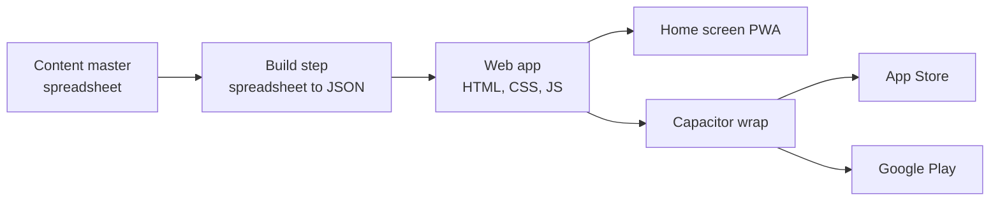
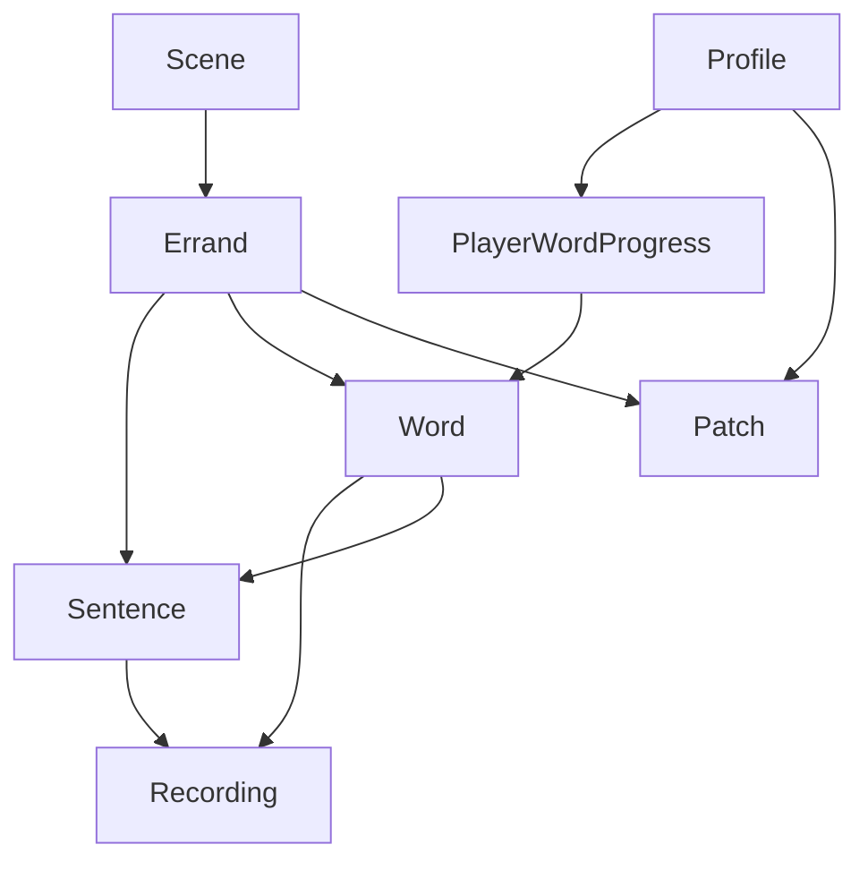

# Nani jo Ghar — Technical Plan

*How the app is built. Companion to the Brief and the Game Design doc.*

Sep 22, 2026 · @Someone

## Architecture

One codebase, three outputs: a website, an iOS app, an Android app.

**No backend.** Nothing is sent anywhere. All content, art and audio ship bundled inside the app, so it works with no signal, which is also what lets it pass Apple's review as a real app rather than a website in a box.

**A local profile per player**, stored on the device only, so Isa and a cousin sharing one tablet each keep their own progress. No accounts, no sign-in, no server to lose a password to.

**Plain web technology**, not a game engine. This is a content pipeline with a renderer on top, and the renderer is simple: images, CSS animation, an audio player, and small tap handlers. A game engine would add complexity nothing here needs.

**Lazy loading.** Each scene's art and audio load only when that scene is first opened, not at install. Keeps the initial download small as scenes are added.

## Screens and devices

**Locked to landscape.** Every scene is a wide illustration with a shopping list or notebook docked to one side, which only works one way round.

**Designed at phone width, scaled up.** The canvas keeps a fixed aspect ratio and grows to fill a tablet screen rather than showing more world. A tablet gets a bigger picture, not a different layout.

| Device | Handling |
| --- | --- |
| Phone | Baseline design, full width |
| Tablet | Same layout, scaled up, letterboxed if the aspect ratio doesn't match |
| Touch targets | Minimum 44px, larger for anything a young child taps often |
| Safe areas | Notches and home indicators respected on both phone and tablet |

One fixed aspect ratio (16:9) for every scene background keeps this simple. A background generated at the wrong ratio is a recurring cost, so the image prompts fix this from the start.

## Data model

Two halves. **Content** ships inside the app and is the same for everyone. **Device state** lives only on that phone and is different for every player.

**Content entities**, built from the content master spreadsheet, shipped as JSON:

| Entity | Key fields | Notes |
| --- | --- | --- |
| Word | english, kutchi_draft, kutchi_confirmed, category, confidence, image_ref, gender, plural_form, syllabus_stage, domain | image_ref points at a sheet and a cell, e.g. `fruit-sheet, row 2, col 3`. gender, plural_form, syllabus_stage and domain are new, see below |
| Recording | word_id or sentence_id, speaker, file, type | type is isolated or carrier_sentence, see Pipelines |
| Sentence | template_kutchi, template_english, slot, chunk_type | chunk_type is new, see "Chunked recording" below |
| Scene | name, kind (hub or spoke), background_ref, unlocks_after | |
| Errand | scene_id, opening_sentence_id, target_words, reward_patch_id, timed | the unit of play, one per session |

**Device entities**, created and stored only on that phone:

| Entity | Key fields | Notes |
| --- | --- | --- |
| Profile | name, avatar, reads, writes | reads and writes are new, see below |
| PlayerWordProgress | profile_id, word_id, understand_stage 1 to 5, produce_stage 1 to 5, last_seen | understand_stage and produce_stage replace the single stage field, see below |
| Patch | profile_id, errand_id, motif | the quilt, as a list of earned patches |
| ChildRecording | word_id, file | the record-and-compare feature, never leaves the device |

**Why the sentence is its own entity, not assembled from words.** A carrier sentence like *Muke bo limu khape* has to be recorded whole, because splicing separate word recordings together sounds robotic and breaks the immersion the whole design depends on. For the bazaar's roughly 16 items that means about 16 short sentence recordings alongside the isolated word recordings, which is a small addition to the recording session and worth it for how natural it sounds.

**Why progress is per word, not per level.** This is the field the design principle actually runs on. A word's stage is read every time it appears anywhere in the game, and it is the main thing deciding how much help that word gets. Splitting it into `understand_stage` and `produce_stage` (below) is the only refinement needed; no other progress field is required.

**Word gains gender, plural_form, syllabus_stage and domain.** Kutchi nouns carry grammatical gender, and adjectives and verbs that go with a noun agree with it, so a word's gender has to be known before its sentences can be generated correctly, not just for the noun's own translation. plural_form is the word's own plural, not assumed from an -s ending. syllabus_stage (S1 to S6) and domain (e.g. kinship, body, weather) are the fields the syllabus and the errand generator sort and filter by; both are set once when a word is confirmed and don't change afterwards. These are populated by Zafar's mother and aunt alongside the Kutchi word itself, at the same review pass, since gender and plural are properties of the word, not separate research.

**Chunked recording, not whole sentences.** Recording a full sentence for every word/number/position combination doesn't scale. Instead a Sentence's `chunk_type` marks it as one of: `frame` (fixed wording that never changes, recorded once per game, e.g. "I need…"), `noun_phrase` (a word plus a quantity, recorded once per word × number actually used, e.g. "two oranges"), `place_phrase` (a word plus a position, recorded once per scene hotspot, e.g. "under the sofa"), or `reaction` (fixed, e.g. "Arre re!", "Well done"). An errand assembles a line by playing chunks back to back with a short pause, which sounds natural because each chunk is a real recorded phrase, never a spliced single word. Where Kutchi's agreement rules glue two chunks together in a way a pause would break (for instance a verb whose ending depends on the object that follows it), that combination is recorded as one chunk instead of two, flagged as such in the content master. This is what makes errand generation possible without exploding the recording list: the generator only ever picks combinations whose chunks already exist, and can output the recording list needed for the next family session.

**Understand vs Produce.** `PlayerWordProgress.understand_stage` works exactly as the single stage field did before: it drives how much visual and audio support a word gets, and how it's tested by listening or reading. `produce_stage` tracks the same word for speaking and writing, always at or behind the understand stage, per the design principle that comprehension comes before production. A word can sit at understand stage 5 while its produce stage is still 1 if the player has never been asked to say or type it.

**Profile gains reads and writes.** Two boolean capability flags set once when a profile is made (or left off for a young child). reads gates whether romanised text is ever shown as a word's own support (stage 3 in the difficulty table); writes gates whether the notebook ever asks that profile to type a word. Neither is a difficulty setting and neither is ever inferred from age; a profile with both off can still reach the highest understand and produce stages through listening and speaking alone.

**Recording carries a source field**, tts_placeholder or family. The app always prefers a family recording when one exists for a word, and falls back to the placeholder otherwise. This is what makes the placeholder replaceable without touching anything else: a word's other fields never change when its audio does.

## Pipelines

Three separate conveyor belts, each turning family-made raw material into bundled app assets. None of them need code changes to run again for a new scene.

**Content: spreadsheet to JSON**

1. The content master spreadsheet is the single source of truth, edited by Zafar's mother and aunt.
2. A short script reads it and writes the Word, Sentence, Scene and Errand JSON the app loads.
3. Adding a scene means adding rows and re-running the script. No new code.

**Audio: recording to bundled files, staged and swappable**

1. **Placeholder today.** Until a real recording exists, a word falls back to text-to-speech reading the romanised spelling in the nearest available voice, Gujarati or Hindi. Clearly worse, clearly temporary, good enough to test the game before anyone has been recorded.
2. **Real voices, staged.** Record in one long take per session, each word or sentence said twice with a pause. A script finds the silences and splits the take into one file per item, named to match the content master.
3. **Multiple speakers stack, they don't replace.** Each new voice adds another Recording row for the same word. The app can pick one at random, or let a player choose whose voice they hear.
4. **Swapping needs no rebuild.** A Recording is just a file matched by name to the content master. Replacing the placeholder with a family voice, or adding a second one, is a file drop, not a code change.

**Art: sheets to sliced assets**

1. Each generated sheet, whether a grid of items or a character in three states, is one image on a plain flat magenta background, hex FF00FF.
2. A script keys out the magenta and slices the sheet into individual transparent PNGs, one per cell.
3. Files are named to match the content master's image_ref, the same linking approach as audio.

## Release path

| Stage | What it is | Needed |
| --- | --- | --- |
| Home screen PWA | The web app, added to a phone home screen, works offline | Nothing. Free, immediate |
| Capacitor wrap | The same code, packaged as a native app | A Mac for the iOS build |
| App Store | Submitted under Kids or Education | Apple Developer Program, $99 or about £79 a year |
| Google Play | Submitted under the Designed for Families programme | One-off $25, about £20 |

**Test on the home screen PWA first.** It looks and behaves like an installed app and costs nothing, so this is how Zafar's mother and the children try it before any store spend.

**Kids category rules,** already reflected in the design: no third-party analytics, no ads, no accounts, a privacy policy. Because nothing leaves the device, the privacy policy is short and true rather than a compliance exercise.

**Apple's thin-wrapper rejection** does not apply here, because the images, audio and logic are bundled inside the app and it works with no internet. That is the bar, and it is already met.

**MVP scope for the first submission**, per the Roadmap doc: Story 1, *Eid at Nani's*, finished end to end, is the release candidate. The other four arcs are conditional on that one landing well with the family and the target audience.

## Open decisions and your next steps

**Open decisions**, worth settling before the first build, not urgent today:

- Whether carrier sentences get recorded per item now, or added once the bazaar scene proves itself
- Whether a second family's Kutchi ever gets added as alternate audio, which the data model already allows for

**Your next steps**

1. Read this doc and the Game Design doc, comment on anything that should change
2. Reply to the open comment on the Brief about the working title
3. When ready, say so and the content master spreadsheet for the bazaar scene gets built next
