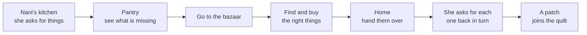
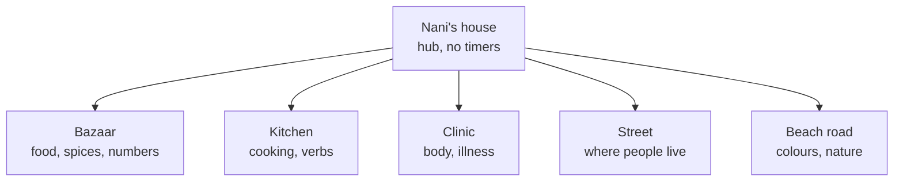

# Nani jo Ghar — Game Design

*How the game works. Companion to the Project Brief. Note: the Roadmap doc is newer where the two disagree — layout contract v2 there supersedes the "Screen layout" section below, and "How the story is told" there supersedes the cutscene-avoidance notes below in spirit (same principle, more developed).*

Sep 23, 2026 · @Someone

## The core loop

A session is one errand, start to finish, in five to eight minutes.

The shape matters more than the setting. Every scene in the game, now and later, runs this same loop: an instruction in Kutchi, a journey, an act of recognition under some pressure, a return, and a short recall at the end that quietly repeats the words you were weakest on.

The final step before the reward is the one doing the teaching work. Nani asking for each item back in turn, and you picking it out of your basket, is spaced repetition wearing a grandmother's voice. The player experiences it as putting the shopping away.

## Per-word difficulty

This is the spine. Every other decision hangs off it.

There is no beginner mode and no expert mode. There is one interaction, and how much help it gives depends on how many times **this player** has met **this word**.

| Stage | Times met | Picture | Written word | Audio | Extra help |
| --- | --- | --- | --- | --- | --- |
| 1. Introduced | First | Shown | Shown | Plays automatically | The item glows |
| 2. Supported | 2 to 4 | Shown | Shown | Plays automatically | None |
| 3. Prompted | 5 to 9 | Shown | Hidden | Plays automatically | None |
| 4. Recalled | 10 to 19 | Shown | Hidden | Tap to replay | None |
| 5. Known | 20+ | Hidden | Hidden | Plays once | None |

A word drops back a stage if it has not been seen for a while, or if the player gets it wrong twice.

Why this solves the hardest problem in the project:

- **A four-year-old** sits at stage one or two for weeks. Glowing pictures, the word spoken every time. It feels like a toy.
- **An adult** moves a word from stage one to stage five inside two sittings, because they get it right every time. By the third session most of their screen is audio-only. It feels like a test they are passing.
- **Both are on the same screen, at the same time**, with no setting to choose and nothing labelled as easy or hard.

It also means spaced repetition needs no separate review mode. The scheduling is the difficulty model. A word you are weak on simply appears more often, with more help, inside ordinary play.

One consequence for the content model: progress is stored per word per player, not as a level number. The technical plan needs to carry that.

*Superseded in part by the Roadmap doc: this single stage is later split into `understand_stage` and `produce_stage`, so listening/reading and speaking/writing progress separately. The table above still describes how support scales; it now applies per skill, not as one number.*

## Teaching without cutscenes

Nani always speaks Kutchi, in full sentences, from the first session. That is only workable because most of each sentence is fixed and repeats forever, with one word changing in the middle.

> **Hedo! Muke \[bo limu\] khape. Bajaar mai vaan.** (Hey! I need two lemons. Go to the market.)

The bold frame never changes across the whole game. Only the bracketed word does. By the fifth errand the player knows the frame the way you know the words to a song you never studied, without it ever having been taught directly. Only the one new word in the middle needs teaching, and five things teach it at once, without a translation:

| Mechanism | What it does |
| --- | --- |
| Gist caption | One short line of English sets the situation before she speaks, e.g. "Nani is cooking. Something's missing." |
| The pantry gap | A shelf with things missing from it, each one a faint outline where it stood. You can see something is absent before you understand a word |
| Pulse sync | As Nani says the word, the matching gap pulses, joining sound and object in time |
| Gesture | She points at the shelf, then at the door |
| The list builds as she talks | Meaning accumulates in front of you, item by item |

**A worked first session, with no prior Kutchi.** Caption: *Nani is cooking. Something is missing.*

1. Nani waves. "Salamun alaykum!"
2. She turns to the shelf and points at two faint gaps.
3. "Muke limu khape." As she says *limu*, the lemon-shaped gap pulses and the word appears beside it.
4. The player taps it. It flies onto the shopping list with a chime.
5. "Ne santra." The orange-shaped gap pulses.
6. The player taps it.
7. "Bajaar mai vaan." She points at the door, which pulses.
8. The player taps the door.

One line of English, two new words taught, four Kutchi sentences heard, three of which recur in every errand from here on.

Why this beats the obvious alternatives:

| Approach | Problem |
| --- | --- |
| Cutscene where Nani explains the items | Passive, and nothing is learned by watching |
| A word list before the level | A vocabulary test with a lesson stapled on |
| Pantry gaps, fixed sentence frame, pulse sync | The teaching and the first test are the same action, and the sentence itself becomes familiar for free |

For a word already known, the pantry gets harder by itself, on the per-word difficulty model in the previous section: at stage one the gap glows and the word is written beneath it; at stage five there is no outline and no writing, just Nani's voice and a shelf, and the player has to know what is missing.

**Skipping.** An adult replaying a scene can tap through the pantry in seconds. Nothing waits on an animation and nothing is unskippable. Skipping never costs anything, because anyone skipping already knows the words.

**Free text.** Where the player is asked to write a word, spelling is matched generously: case ignored, doubled letters collapsed, a/aa and i/ee and u/oo treated as the same, d/dh and t/th and k/kh treated as the same, then edit distance. The family's preferred spelling is shown afterwards, so people converge without ever being marked wrong.

## The quilt

There are no points, stars, XP or streaks. Progress is a quilt on the wall of Nani's house, and every finished errand adds a patch.

Kutch has a real patchwork tradition, so the object is not decoration borrowed from another game. It sits in the hub, it grows, and it is the first thing a returning player sees.

Why an object rather than a number:

- A four-year-old understands a picture filling in. A number going up means nothing to them.
- An adult is not insulted by it, because it is a thing being made rather than a score being awarded.
- It cannot be gamed. There is no way to grind it, because patches come from errands and errands come from vocabulary.
- It gives the whole game an ending. A finished quilt is a finished game, which most language apps deliberately never offer.

**Patch design.** Each patch carries a motif from the scene that earned it: fruit for the bazaar, thread spools for the blanket quest, a stethoscope for the clinic. Tapping a patch replays that errand. So the quilt doubles as the level select screen, and revisiting old material is framed as looking at something you made.

**Pocket money** sits alongside it as a small spendable currency, earned from errands and given at Eid. It buys nothing cosmetic. It buys things that change play: an extra few seconds on a timed scene, a hint that pauses the clock, a new shelf for Nani's kitchen that opens a new set of words. Money that buys content is content. Money that buys hats is grinding.

## The notebook

The player carries a notebook. Every word they meet writes itself in, with its picture and its recording.

It does four jobs at once:

1. **Dictionary.** Tap any word to hear it again. The only reference the game needs.
2. **Collection.** A filling book is its own reward, and it shows what is left.
3. **Quest tool.** Where the blanket quest writes down each relative's favourite colour, so the notebook is used inside play rather than only consulted.
4. **Writing practice.** The one place where typing a word is asked for, and only from stage three upward.

It is also where an adult goes to cram, which is a real behaviour worth supporting rather than fighting. A grid of every word met, sorted by how shaky it is, with audio on tap. That page alone would be useful to Zafar with no game attached.

**Handwriting is deliberately absent.** Kutchi has no agreed script, so asking a child to write it would mean choosing one, which is a decision for the community and not for this app.

## The world

Hub and spokes. Nani's house is the hub and it is always calm: no timers, no failure, nobody hurrying you. Everything outside it is a spoke holding one area of vocabulary.

**How it opens.** One spoke at a time, unlocked by the errand that needs it. The map is never a wall of locked doors, because a place you cannot go to simply is not drawn yet. The world grows rather than unlocking.

**Semi-open, not open.** Once a place is known you can walk back to it whenever you like and buy things with pocket money, or take on a small side errand. But there is always one lit path: whatever Nani wants today. A child who does not want to choose never has to, and an adult who wants to wander can.

**Travel is two taps.** No minigame between locations. That is the shortest route to bloat.

**People live here.** The relatives from the family unit are not a vocabulary list, they are residents. Masi is at the beach road, Mama runs a stall, Fui is next door. This is what makes the blanket quest work, and it means kinship words are learned by visiting people rather than by tapping faces on a chart.

## Scene catalogue

The teacher's Unit 1 to 9 sequence is already a curriculum built by someone who teaches this for a living. It is used as the spine, with a game mode against each unit.

| Unit | Vocabulary | Scene | Mechanic |
| --- | --- | --- | --- |
| 1 | Numbers | Woven through everything | Quantities at every stall |
| 2 | Greetings, how are you | The doorstep | Who is knocking, and how you answer |
| 3 | Family, jobs | The street | Visiting relatives, who does what |
| 4 | Actions | Charades in the yard | Tap the person doing what she says |
| 5 | Body, illness | The clinic | Find out what hurts, fetch the medicine |
| 6 | Food, drink, meals | **Bazaar** and kitchen | Shopping list, then cooking |
| 7 | Prepositions, where you live | Hide and seek | Put the cat behind the door, on the roof |
| 8 | Journey, colours, nature | Beach road | Spot what she names as it goes past |
| 9 | Getting ready, visiting | Pack the bag | Timed hunt for socks, shoes, sweets |

Two scenes deserve spelling out.

**The bazaar** is the first build. Nani names what is missing, the pantry turns it into a list, you go to the stall, the seller asks what you want and how many, and you come home and hand each thing over. It teaches food, numbers and the shape of a transaction, and it is the template every other scene is a variation on.

**The blanket quest** is the second build, and it is the most complete idea in the design.

1. Nani is making a quilt and needs coloured thread. She does not know which colours.
2. You go round the family asking each person their favourite colour. Masi, Mama, Fui, Dada. Each answers in Kutchi and shows you the colour.
3. Each answer writes itself into your notebook, next to that person's face.
4. You take the notebook to the bazaar and buy the threads, which means reading back what you wrote.
5. You bring them home and Nani asks for each colour in turn. You pick from your basket.
6. The quilt gains a patch made from those colours.

One quest, and it carries kinship terms, colours, asking a question, reading back, and a recall drill at the end. The reward is an object that stays on the wall, made of the colours the player's own relatives chose. It is worth building early because it proves the whole design: teaching by doing, spaced repetition disguised as a task, and progress you can see.

## Buying quantity

The shopkeeper asks for each item by name and how many. The player answers by **tapping the item once per unit wanted** — tap the lemon twice for two lemons — rather than a slider, a keypad, or typed digits.

- No reading or numeral recognition required, so it works before a child can read numbers, and it works identically for an adult.
- Each tap plays the count aloud in Kutchi as it lands (*hikdo, bo, trae...*), so the numbers 1–10 (already in the content master) get repeated inside ordinary play rather than needing their own drill.
- The chalkboard shows the target number the shopkeeper actually asked for, large digits, for the length of that ask (per the layout contract above). The sidebar's running count climbs with each tap.
- Capped at the number asked for: the item stops accepting taps once the target is reached, and a tap past the cap plays a small "that's enough" cue rather than overshooting silently.
- Undercounting is not a fail state: handing over the wrong quantity is a normal wrong answer under the per-word difficulty rules (drops the word a stage on a second miss), not a separate penalty system.

This was a working assumption for the first build (proposed 23 Sep 2026), not yet play-tested. Worth revisiting once someone has actually tapped it on a phone — in particular whether tapping ten times for a big number gets tedious, in which case a "tap and hold to keep counting" variant is the natural fallback.

## Mechanics adopted

| Mechanic | What it does | Why it earns its place |
| --- | --- | --- |
| Calm and busy places | Nani's house never has a timer; some outside scenes do | Timers everywhere drive off young children; timers nowhere bore adults |
| Optional urgency | Timed runs are always opt-in and always for a bonus | Keeps the tension, removes the punishment |
| Grandparent mode | The adult holds the phone and plays the shopkeeper, reading their line aloud | Turns the app into a script for a conversation instead of a substitute for one |
| Warm failure | A wrong answer gets a gentle spoken "Arre re!" from Nani, never a buzzer | Anxiety measurably suppresses language uptake |
| Mystery containers | Unlabelled jars and sacks that must be chosen by ear | Reframes a vocabulary test as finding out what is inside |
| Functional purchases | Pocket money buys extra seconds, hints, new shelves | Rewards that feed back into play read as content, not grinding |
| Play both sides | Sometimes the player is the shopkeeper asking the questions | Production, not only recognition |
| Errand log | A short recap at the end of a session, in Nani's voice | The spaced repetition drill, disguised as putting the shopping away |

**Grandparent mode is the one to protect.** Most language apps put the fluent elder outside the loop. Here the app shows Zafar's mother her line in large type, she says it to the child herself, the child answers, she marks it. The app becomes scaffolding for a conversation between two people in the same room. It also happens to be the reason the project exists.

## Mechanics rejected

Written down so they do not get proposed again in six months.

| Rejected | Why |
| --- | --- |
| Double-or-nothing haggling | Losing your money and items for being slow punishes the youngest players hardest, and wager mechanics are the first thing scrutinised in anything aimed at children. The tension moves to the upside instead: be quick and Nani is extra pleased |
| Endless runner between locations | A different game bolted onto this one. Teaches nothing, and it is exactly the padding adults resent |
| Streaks and daily goals | Manufacture guilt, and punish the week someone is ill or away |
| Lives and hearts | Failure should cost nothing here |
| Leaderboards and social comparison | Wrong for a family app, and a privacy problem for children |
| Card battlers, escape rooms | Good mechanics, different app |
| Text-to-speech for Kutchi | Does not exist, and a synthetic approximation would teach the wrong pronunciation |
| Teaching a written script | Kutchi has no agreed standard. Choosing one is the community's decision, not this app's |
| Cutscenes | Passive. Teaching happens inside the interaction or not at all |

One rule behind most of these: **nothing in this game may make a child feel bad.** The game can be hard, and should be for an adult, but the cost of failure is always another go.

## Audio and speaking

There is no Kutchi speech recognition and no Kutchi voice synthesis, from any vendor. Every sound in the game is a recording of a person.

**Recording.** One long take per session rather than one file per word. The speaker says each word twice with a pause, and the file is split automatically on the silences. Forty words takes about fifteen minutes with a cup of tea. The room matters more than the microphone: a soft room with the curtains shut beats a good microphone in a kitchen.

**Multiple voices are a feature.** The same word recorded by Zafar's mother, his aunt and a cousin, played at random, teaches that a word survives being said differently. It also makes the world feel populated.

**Speaking, staged.**

| Stage | What the player does | What the app does | Needs |
| --- | --- | --- | --- |
| 1 | Records themselves saying a word | Plays it back beside the family recording, side by side | Nothing. This is shadowing, and it works |
| 2 | Says one of a handful of known words | Decides which one they said | About five recordings of each word, from a few speakers |
| 3 | Speaks freely | Understands them | A corpus that does not yet exist |

Stage two is the one people assume is impossible, and it is not. It is not speech recognition, it is classification among a small known set: the player is looking at eight fruits and says one of them. Published work on few-shot keyword spotting builds a classifier for an unseen language from five examples per word, at usable accuracy. Your family can produce that training set in an afternoon.

Stage three is a long game. An app used by enough families, with consent, becomes the first real corpus of spoken Kutchi. Worth noting in the plan and building nothing towards yet.

**A line to hold.** Recordings a child makes in the app stay on the device and are never uploaded. The corpus, if it ever exists, comes from adults who chose to contribute their voice, and the two are never mixed.

## Art direction

**The setting is a Muslim Kutchi one.** Not generic Indian, and not the tropical look of the first mockup. In practice: headscarves and dupattas rather than sari and bindi, no tilak or temple imagery, a minaret rather than a shikhara on the skyline, Salamun alaykum as the greeting, a halal butcher, and food that is actually cooked in Kutchi Memon and Khoja homes.

**The style** is children's storybook illustration: bright saturated colour, soft cel shading, thick soft outlines. Warm enough for a four-year-old, not so babyish that an adult feels patronised.

**Palette** is taken from Kutch rather than from a generic app: ajrakh indigo and madder red, marigold, whitewash, terracotta. The interface colours are sampled directly out of the finished artwork, so the buttons are literally made of the picture's own colours.

**The hard separation.** Images are the world: backgrounds, characters, objects. HTML is the interface: text, buttons, lists, the notebook. No image ever contains a word. This is why any word can change without regenerating art, and why the app can carry a second family's spelling later.

**Producing the art.** Images are generated in ChatGPT, then cut up and layered. Two rules learned already:

- Generate a set of related items as **one grid**, not one at a time, so the style is guaranteed to match. Four by four, sixteen items, is about the reliability ceiling; ten by ten falls apart.
- Generate characters as **one image containing all their states** side by side, on a plain flat magenta background, hex FF00FF. Mouth closed, mouth open, celebrating. Swapping between mouth closed and mouth open while audio plays reads convincingly as talking, and generating them together stops the character drifting.

**Screen layout — superseded.** The section that was here (surface at two-thirds height, quiet left quarter, upper-body sprites, eight items in two rows) was the working layout during the original bazaar-only build. **Layout contract v2 in the Roadmap doc replaces it entirely**, following the two 23 Sep playtests: the sidebar is now its own column rather than an overlaid quiet quarter, items sit in a single row per zone rather than two, and the carried-container mechanic (basket/tray) didn't exist yet when this section was written. Kept here only as a historical note; build against the Roadmap's layout contract v2, not this section.

**Making it feel alive** needs no video and no animation software. Layered images moved in code: the background drifts a little, the seller bobs, her arm lifts when she speaks, fruit scales up and arcs into the basket, bunting sways. That is the difference between a slideshow and a game. *See also the character animation approach in the playtest review and the "Alive Nani" test brief — the LivePortrait/scripted-edit pipeline is the current plan for this, refining the "layered images moved in code" idea below into something concrete.*

**Sound** matters as much as picture. Market chatter under the bazaar, a kettle in the kitchen, gulls on the beach road. A warm chime for correct, never a buzzer for wrong.

## Session shape and age fit

**One errand is one session**, five to eight minutes. It ends at a natural point, with a patch, and the game does not ask you to stay. An adult will do four errands back to back; a five-year-old will do one. Both are complete.

**Age fit is handled by the difficulty model rather than by separate content.** There is no children's version and no adult version. The same bazaar is a bright tapping game for a child at stage one and an audio-only recall drill for an adult at stage five.

Where age does change things:

|  | Younger child | Adult |
| --- | --- | --- |
| Reading | Not required anywhere | Written word available until stage three |
| Timers | Off by default | On by default, still optional |
| Session end | After one errand | Keeps going while they want to |
| Failure | Nani says "Arre re!" and you try again | The same, and it stings enough |

**Tone.** Warm, never sarcastic, never babyish. Nani is pleased when you get it right and unbothered when you do not. Nothing in the game hurries, scolds or nags, and there are no notifications.

**Accessibility.** Everything is audio-first, so a child who cannot read plays exactly the same game. Touch targets sized for four-year-old fingers. Subtitles for every spoken line, in English and romanised Kutchi. Colour never carries meaning on its own, which matters particularly in the blanket quest, where each colour is also named aloud and written.

## Build order

Each stage has to prove something before the next one is worth starting.

| Stage | What gets built | What it proves |
| --- | --- | --- |
| 1 | Content master: every word for the bazaar, with source and confidence, reviewed by Zafar's mother and aunt | That the language is right before anything is drawn or recorded |
| 2 | Recording session, one long take, split into files | That recording together is enjoyable. If it is not, stop here |
| 3 | Art: stall background, seller in three states, one grid of produce | That the look holds up and the grid trick works |
| 4 | Bazaar scene, with the difficulty model running from day one | That the core loop is fun with real voices in it |
| 5 | Nani's kitchen and the pantry | That teaching by absence works |
| 6 | The quilt and pocket money | That progress as an object motivates |
| 7 | Family, colours, the blanket quest | That a multi-step quest holds a child's attention |
| 8 | Notebook and grandparent mode | That the adult in the room stays in the loop |
| 9 | Remaining scenes, one at a time | That adding a scene is a content job, not a build job |
| 10 | Wrap for App Store and Google Play | Distribution |

Stage two is the real gate. If the evening spent recording with Zafar's mother is a good evening, this project finishes. Everything downstream is craft.

**The order is deliberately content-first.** The difficulty model is built into the first scene rather than added later, because retrofitting it would mean rewriting everything. The quilt, the notebook and the map are all deferred, because they look like progress and are not.

*Status as of 23 Sep 2026, per the Roadmap doc: stages 1–4 have been through two playtests (rougher than "finished" but proving the loop); the actual build order in progress is now the Roadmap's phase sequence, which reorganises stages 4 onward around story arcs and game modes rather than this single-bazaar sequence. Read the Roadmap for current status.*
