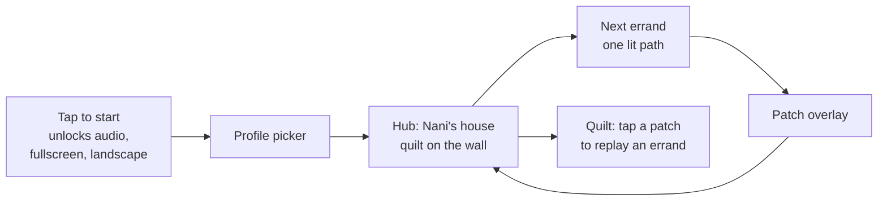

# Code map: how the code is laid out

> **Stale points (what `docs/process/rules.md` now overrides; the text below is left as written).**
> - The root README's Architecture and Files sections describe the 23 Sept fruit-bowl MVP: the Phaser 3 scene layer, IndexedDB `js/storage.js` shell and first-person hands are the legacy bowl page only. Live pages use plain web technology and the shared modules in `js/shared/`; the one save is `js/shared/save.js` (localStorage `njg-save`) (see `shared-api.md` §11)
> - "Storage rules": IndexedDB, one record per profile → the live save is `Save` in `js/shared/save.js`; the IndexedDB shell is legacy (bowl page only)
> - Thin shell spec (quilt on the wall, patches, the quilt replay) → quilt → bookshelf (decision 4); Eid-decorations hub → Birthday (H36–H41)
> - Hands in the file list → parked, none in Cook (H13)
> - Stars in the profile or progress data → three badges (H5)
> - Browser tests and run commands: see `testing.md`

Where things live in the code. Copied from the root README (which becomes a short front door in Phase 3) and the old Roadmap.

---

## Architecture

> from: README.md § Architecture

- **Scene layer = Phaser 3** (vendored at `js/vendor/phaser.min.js`, no
  CDN at runtime). The world is fixed at 1600×900 — the backgrounds' own
  pixel size — scaled with `Phaser.Scale.FIT`, centred on both axes.
- **UI layer = plain HTML/CSS** beside/over the canvas: the recipe
  sidebar, speech bubble (positioned beside whoever is talking),
  narration strip, go button, overlays. A CSS grid (`sidebar | game`),
  sized purely from `aspect-ratio` media queries — no JS measuring. In
  every landscape shape (4:3 and wider) the sidebar is its own column and
  **never sits on top of the game**; wide screens (Flip-style 22:9) get a
  sidebar exactly as wide as the leftover space, so the game is a clean
  16:9. Only screens narrower than 4:3 (portrait tablets) get an
  off-canvas drawer, which never opens by itself mid-task (its tab
  pulses instead) and has a close button.
- **Layers, back to front:** background → character → counter/island
  (hides the character's lower body) → items on shelves/counter (with
  contact shadows) → Nani's bowl (back, fruit, front) → your basket
  (back, fruit, front) → anything in flight. Containers are drawn as a
  back and a front image so their contents sit *inside* them.
- **Scenes are data.** `data/scenes/kitchen.json` and `data/scenes/bazaar.json`
  hold every slot, container and character anchor as background pixel
  coordinates, measured off the real art and verified with
  `build/place_preview.py` (renders a labelled composite PNG per scene —
  look at it before trusting a position). `data/errands.json` only says
  which words go in which slot *pool*; the actual slot assignment is
  shuffled every playthrough, so the correct answer's position is never
  the tell.
- **Every tappable item uses pixel-perfect hit-testing**
  (`setInteractive({ pixelPerfect: true, alphaTolerance: 1 })`), so an
  overlapping transparent bounding box can never steal a tap from the
  item underneath — the exact bug that broke v2's bazaar.
- **Audio** plays through Phaser's sound manager (handles mobile unlock
  on the first tap) and resolves on the `complete` event, not on
  playback start — fixes v2's overlapping lines. `data/audio-manifest.json`
  (from `build/build_audio_manifest.py`) lists which recordings actually
  exist, so the game never probes for a file at runtime — a HEAD 404
  logs a console error even when the JS catches it, which would have
  failed the "no console errors" check. Missing lines fall back to
  on-device speech synthesis reading the romanised Kutchi (never a real
  Kutchi voice — none exists from any vendor).

---

## Files

> from: README.md § Files

- `build/build_content.py` — xlsx → `data/content.json`. Never invents
  Kutchi: confirmed → draft-flagged → English-only, in that order.
  **Never resave the tracked xlsx with openpyxl** — its "Carrier
  sentences" tab has Excel formula columns, and `wb.save()` after a plain
  `load_workbook()` silently discards their cached values (found and
  reverted with `git checkout` once already). Add rows by hand in
  Excel/LibreOffice/Google Sheets, which do recalculate.
- `build/slice_sheet.py` — keys out a sheet's flat magenta (or, with
  `--key grey`, #808080 for steel and glass) background and cuts each grid
  cell to its own transparent PNG with a soft, fringe-free edge (the art
  pipeline's "sheets to sliced assets" step). Needs numpy and scipy.
  `build/slice_chatgpt_batch1.sh` re-runs ChatGPT batch 1;
  `build/slice_chatgpt_batch3.sh` re-runs batch 3's cook sheets (with
  `build/cut_glow.py` for the gas flames and `build/fit_sprites.py` for
  sizes);
  `build/slice_chatgpt_batch3_dump3.sh` re-runs batch 3's third dump
  (`build/cut_boxes.py` cuts off-grid poses by hand-set boxes,
  `build/cut_counter_moods.py` cuts the cook counter moods into
  `assets/cook/characters/next/`, `build/clinic_final_art.py` adds the
  clinic's final art to `data/clinic/rough-art.json` beside the rough);
  `build/contact_sheet.py` makes the black/white QA contact sheets;
  `build/bg_align_check.py` checks a background's lighting states line up.
- `build/lines_needing_family.py` — writes
  `build/reports/lines-needing-family.md`: every sentence or word used by
  an errand with no Kutchi yet, or still a draft, and where it's used.
- `build/build_audio.py` — generates placeholder MP3s via `espeak-ng`.
- `build/build_audio_manifest.py` — scans `assets/audio/` and writes
  `data/audio-manifest.json`, so the game knows what exists without
  probing at runtime. Re-run after adding/removing an audio file.
- `build/make_placeholder_art.py` — the parchment texture (PIL).
- `build/make_scene_art.py` — the playtest-2 scene art, all derived from
  existing art: cleaned bazaar background, kitchen island, basket
  back/front, brass bowl back/front, each character's mouth frame and
  head-aligned happy pose. Needs Pillow + numpy.
- `build/place_preview.py` — renders `build/previews/<scene>.png` with
  every layer in game order (character behind the counter, occluder,
  slots with shadows, bowl and basket with sample contents, bubble box).
  Run this after touching any `data/scenes/*.json`.
- `build/test_e2e.py` — Playwright, six viewports (Flip 5 landscape,
  1366×768, 1440×900, 1280×800, iPad landscape and portrait). Plays the
  whole errand, including a wrong tap in the bazaar and at the bowl.
  Taps a visible, opaque, uncovered pixel of each sprite via
  `window.__njg.debugItems()`, and asserts nothing in the page covers
  it. Checks basket and bowl contents. Screenshots every step to
  `build/screenshots/<viewport>/`.
- `data/scenes/*.json` — per scene, in background pixels: character
  (behind the counter), occluder, speech-bubble anchor, bowl/basket with
  their inside spots, stall/shelf slots (max width and height), ambient
  effects.
- `assets/scene/` — island, basket and bowl layers (generated).
- `data/errands.json` — the one errand: which words, which slot pools,
  the reward patch.
- `data/audio-manifest.json` — generated; which recordings exist.
- `js/data.js` — loads content, errands, scenes, the audio manifest.
- `js/storage.js` — the only module that touches storage: IndexedDB, one
  `profiles` object store, one record per profile.
- `js/progress.js` — per-word `understand_stage`/`produce_stage`, read and
  written through the profile `js/shell.js` attaches
  (`Progress.attachProfile`), advances on correct recall only.
- `js/audio.js` — plays a recording through Phaser's sound manager if
  one exists, else falls back to on-device speech synthesis.
- `js/ui.js` — the HTML/CSS UI layer: sidebar list with quantities,
  speech bubble, narration, overlays, quilt (via `global.NjgProfile`).
- `js/shell.js` — launch flow, profile picker, create profile, hub
  (decorations, settings cog, quilt), leave-errand, switch profile.
- `js/game.js` — `NjgGame` (`prepare`/`playErrand`/`leaveErrand`, driven by
  `js/shell.js`) and the Phaser scenes: kitchen intro (with the intro
  beat) → bazaar → bowl fill → patch (with the outro beat). Also the
  Container (basket/bowl) and Character (behind-counter, breathing,
  talking) classes, and `runBeat()`/`BEAT_VISUALS` for story beats.
- `js/vendor/phaser.min.js` — vendored, no CDN at runtime.
- `lab/basket-angle.html`, `lab/nani-alive.html` — standalone test pages,
  not part of the main game (see the Alive Nani build brief/doc for the
  latter).

---

## The thin shell spec and storage rules

> from: docs/archive/design-v1/Roadmap and Story Structure.md § Thin shell spec (including Storage rules)

## Thin shell spec

The per-word difficulty model is saved state, so saving belongs in phase 2 alongside production Shopping, not at the end. Everything stays on the device. Build details are in Build Brief v4.

### Launch flow

### MVP scope

| Item | Behaviour |
| --- | --- |
| **Tap to start** | Kept from the current build: unlocks audio, requests fullscreen and landscape lock |
| **Profile picker** | Up to 6 profiles on a device, each a large avatar tile with a name. "+" to add |
| **Create profile** | Name (typed by an adult), avatar from a set of ~8 illustrations, and two toggles set by the adult: "Can read" (reads) and "Can type" (writes). Neither is a difficulty setting |
| **Hub** | Nani's kitchen with the quilt on the wall, party decorations that accumulate as errands are finished, and one clearly lit "Nani needs you" button to the next errand. No map yet |
| **Replay** | Tapping a quilt patch replays that errand, per the Game Design doc |
| **Leave an errand** | A home tab on the sidebar rail, with a one-tap confirm. Word progress already earned is kept; the errand restarts from its beginning next time |
| **Settings** (behind an adult hold, press for 3 seconds) | Volume, rename or delete a profile, reset a profile's progress |

### What gets saved, and when

| Data | Saved when | Notes |
| --- | --- | --- |
| Profile (name, avatar, reads, writes) | On create or edit | |
| PlayerWordProgress (understand_stage, produce_stage, last_seen, recent misses) | Every time a word's stage changes | The difficulty model; never lost mid-errand |
| Completed errands, earned patches, hub decorations | At the patch overlay | Drives the hub's lit path, the quilt and the dressing |
| Last errand in progress | At each phase boundary (intro, shop, home) | MVP resumes at the start of that errand, not mid-phase |
| Settings | On change | |

### Storage rules

- IndexedDB through one small storage module, one record per profile, every record carrying a `schema_version` so later versions can migrate old saves.
- Call `navigator.storage.persist()` on first profile creation to ask the browser not to clear the data.
- iPhone Safari may clear stored data for a web page that goes unused for a while unless it has been added to the home screen. Family testing therefore uses the home-screen install, and the Capacitor wrap removes the issue for the store versions. Verify this behaviour at build time.
- If storage is unavailable (for example a private browsing window), the game still plays, with a gentle notice that progress won't be kept.
- Nothing is uploaded, synced or exported off the device. No accounts, no analytics.
