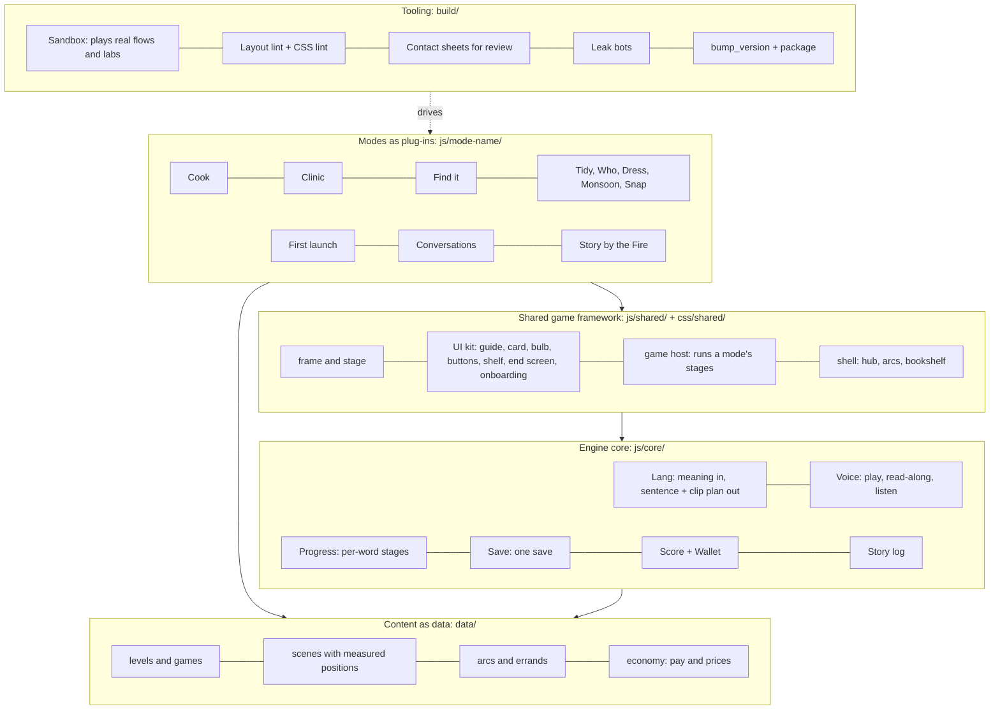

# The code's target operating model

Step 2a, 1 Oct 2026, for Zafar's approval. Nothing here is built yet; step 3 builds it, one session at a time (the plan is in [`gap-analysis.md`](gap-analysis.md)). Where this file and `docs/process/rules.md` disagree, the rulebook wins.

**In one paragraph.** The game becomes four layers. At the bottom, an **engine core** that every mode shares: the language engine, voices and speech recognition, per-word progress, the one save, and one scoring and pocket-money model. On top of it, a **shared game framework**: one screen frame, one set of UI components, one way to run a mini-game. On top of that, **content as data**: levels, scenes, recipes, patients, arcs and lines written as meanings. And at the top, **modes as plug-ins**: Cook, the clinic, Find it and the rest each fill in one standard form and get the whole framework for free. Around it all sits the **tooling** that lets a session play the real game, measure it and screenshot it before anyone calls it done.

> **Words used here.** *Module*: one code file with a clear job. *Interface* (or *contract*): the fixed list of calls one part offers another, so either side can change inside without breaking the other. *Plug-in*: a part that fits a standard interface, like an appliance into a socket. *Adapter*: a thin layer that makes old code look like the new interface, so it can be replaced later without the callers noticing. *Lint*: an automatic check that reads code or measures a screen and lists rule breaks. *Sandbox*: a test browser that plays the game by itself.

---

## 1. The picture



The arrows point one way only: a mode may call the framework and the core; the framework may call the core; **the core never calls a mode**, and no mode calls another mode. That one rule is what keeps sessions from colliding (§ 9).

---

## 2. What "right-sized" means here

This is a family game built by Claude sessions, not a studio product. So:

- **Static files, no server, no accounts** (J1, J2). The same files run on GitHub Pages and inside the Capacitor app.
- **No bundler, no framework, no TypeScript build.** Plain JavaScript, loaded as standard ES modules (§ 10). Sessions can't break a build step that doesn't exist.
- **Keep what works.** The save (`js/shared/save.js`), the end screen, the order card, the onboarding kit, the guide box, the button kit, the speech recogniser, Cook's stations and the clinic's heal-game contract are good and stay. Most of step 3 is *moving the rest onto them*, not rewriting.
- **Keep Phaser for Cook only** (§ 10). Cook's seven stations are built on it; porting them would cost weeks and risk every play-tested fix. New modes are DOM/SVG like the clinic.
- **Two interfaces matter most:** the mode plug-in (§ 6) and the language engine call (§ 3.1). Get those right and the rest can be improved one file at a time.
- **No new abstractions without two users.** A shared component exists because two modes need it; one-off code stays in its mode.

---

## 3. Layer 1: the engine core (`js/core/`)

Pure logic, no drawing. Each part runs in the browser and in Node (so tests and bots use the same code). Each owns one save namespace (§ 3.4).

### 3.1 Language: `js/core/lang/` and `data/lang/`

The engine's internals, data formats and API are step 2b's: [`docs/language/engine-design.md`](../language/engine-design.md) (API in its § 6). This file only places it.

- **Where it sits.** Code in `js/core/lang/` (the general linearizer and clip planner; no Kutchi in it, G13). Data in `data/lang/` (`lexicon.json`, `paradigms.json`, `abstract.json`, `concrete.json`, `params.json`); the recordings index stays `data/family-audio.json`.
- **The boundary.** A mode hands over a **meaning** and context and gets back either a sentence (display segments, card rows, a clip plan) or a **gap** with an honest grey-italic placeholder (G2). Modes never build Kutchi strings, never pick a word form, never join words with *ne*, *pela* or *ne poi*.
  ```js
  const r = Lang.say({ fn: "Need", who: "p1", thing: { fn: "Item", kind: "n.samosa", n: 2 } },
                     { speaker: nana, addressee: child, level });
  card.show(r.rows); Voice.say(r);   // rows and speech from the same result (F10)
  ```
- **One door for words on screen too.** The order card, the shelf chips, the end-screen word review and the bulb's English all take `Lang` results, so the review shows the exact form the order used (fixes SH-02 at its root).
- **Until step 4:** step 3 puts a `Lang` **adapter** in `js/core/lang/` with the same calls, built on today's proto-engine (`js/cook/lang.js` + `js/cook/order.js` + `data/cook.json` `lines`/`grammar`). Step 3 builds only this **seam**, and moves the clinic's hard-coded Kutchi through it (Cook's callers already use the proto-engine). Moving Cook's callers onto `Lang.say` is step 4d's job (engine-design § 14), and step 4 replaces the inside. No new Kutchi or grammar is written in step 3: anything the adapter can't say comes back as a gap.
- **Gaps are collected**, not hidden: every gap the sandbox meets is written to the gap list that becomes Mum's next questions (engine-design § 10).

### 3.2 Voice and speech: `js/core/voice.js` (+ `js/shared/speech.js`, unchanged)

One player for every voice in the game, replacing the six playback paths there are today.

- `Voice.say(result, {channel, onWord})` plays a `Lang` clip plan in order and reports each word as it starts (for the read-along underline, E4). `Voice.word(id)` for a chip or the face replay. `Voice.stop(channel)`.
- **One queue per screen:** a new line on the same channel waits or replaces, never overlaps (PAN-04).
- **Never blocks input** (E5): it returns at once; a mode may await it but the framework never locks taps while it plays.
- **Family voices only in the store app** (G14, AUD-02). GitHub Pages is the test site (J2), and G14 allows computer voices for testing, so on Pages a line with no family recording yet is still heard: Voice plays the OK family clip if there is one, else (on the test path) an unchecked clip or the existing TTS file, marked as such in the dev log. A `?dev=voice` flag shows which is which. The TTS files stay in the repo; the store package (§ 8.5) leaves them and the unchecked clips out, so the app only ever plays OK family clips.
- **Stitched speech until the pre-publish pass** (decision 26, G12; R6): the setting `phrases` is off everywhere, so a family clip of more than one word never plays and every line is said word by word from the family's single-word clips (a line whose words are all recorded is stitched ahead of any stand-in). Lines with a missing word keep the test path's stand-ins as before; the store path says the words it has and reports the rest as gaps. The packager turns whole phrases on for the pre-publish quality pass (`window.NJG_VOICE_PHRASES = true`; `?voice=phrases` previews it). R2's voice-parity test now holds Cook's search equal to the core's with phrases on, and a second test holds the stitched rule (`build/core/voice-parity.test.mjs`).
- **`Lang.play(result)`** (engine-design § 6.2) is one line: it hands the result to `Voice.say(result)`, so there is one audio queue.
- `Voice.listen({choices})` wraps the on-device recogniser (`js/shared/speech.js`, J1). The speaking moment's screen stays `js/shared/say.js`. Speaking never blocks (E32).

### 3.3 Progress: `js/core/progress.js`

Per-word, per-player progress, the "spine" of the design (`docs/game-design/progression-and-scoring.md`).

- Each word has `understand_stage` and `produce_stage` (1–5). **Up a stage on correct recall from the Kutchi; down after two misses** (G23). The thresholds live in `data/progress.json`, not code.
- Modes report **evidence**, not stages: `Progress.heard(wordId, {ok, cue, firstTry})` and `Progress.said(wordId, {ok, via})`. `cue` says whether the child had only the Kutchi to go on (only then does a right answer count as recall).
- Modes ask **how much help** to give: `Progress.support(wordId)` → `{text, picture, autoPlay, hintAfterMs}`. This replaces Cook's `labelMode`, `cardHidden` and `hintDelay`, and gives the clinic and every other mode the same per-word behaviour.
- One rule for "one place for a word's text at a time" (G22) lives here, not in each mode.

### 3.4 Save: `js/core/save.js` (today's `js/shared/save.js`, moved, same API)

The one save stays exactly as built (localStorage, players, namespaces, export/import, migrations). What changes is that **every namespace is registered in one table**, and nothing else touches storage (J3, B17):

| Namespace | Owner | Holds |
|---|---|---|
| root | Save | players, current player, device settings |
| `character` | first launch | the player's look |
| `words` | Progress | per-word stages (moved out of Cook's save) |
| `wallet` | Wallet | the one purse, owned upgrades (merges Cook's and the clinic's coins) |
| `ui` | framework | personal bests, onboarding "seen", fade-ins |
| `story` | Story log, arcs | the day log, arc and chapter progress |
| `shelf` | shell | finished arcs' books (the bookshelf, decision 4) |
| `conversations` | Conversations | its state |
| `speech` | Voice | voice enrolment |
| `<mode>` | each mode | that mode's own state only (Cook's day, the clinic's stage levels) |

Schema 2 migrates the old shapes once (Cook's `words`, `coins`, `owned`; the clinic's coins), keeping the old keys as a way back, as schema 1 did.

### 3.5 Score and Wallet: `js/core/score.js`, `js/core/wallet.js`

**One scoring model for every mode** (H5, F12–F13, decisions 1–3, 10). A mode never computes a badge, a star or a coin.

1. During a round the framework's **tally** collects what happened: each tested row (which word, right or wrong, first try or not), each hint (the light bulb, E25; a peek at a closed card, F9), speaking moments, and the time from first action to Done.
2. At the end, `Score.finish(round)` returns:
   - **the three badges**: time (against the personal best for that mode, game and level), accuracy (gold and grey ticks, "7/10"), hints (bulbs used). The badge rules already in `js/shared/results.js` move here.
   - **pocket money**, by decision 10: `pay = base × tasks done (volume) × quality × difficulty`, where quality rises with ticks and falls with hints and slow time, and correct speaking pays extra (decision 2). All the numbers live in `data/economy.json`. The child only ever sees coins arriving, never the sum (decision 2).
3. In the same step it writes the best (`ui`), the coins (`wallet`), the word evidence (`words`) and a story log line (`story`), so nothing is half-saved.

**Calibration** is a tooling job, not a guess: the sandbox's bots play a few hundred simulated games at three skill levels and check that an upgrade becomes affordable about every 2–3 games at first, stretching to every 4–5 (decision 10). Prices sit in the same data file.

**Wallet** rules: coins only go up, except when the child buys something (E29: never lose what you earned; so no daily wages). Upgrades automate physical steps, never the listening (H6).

There are **no stars** anywhere in the target: no ear star, voice star or star sets (H5, J7).

### 3.6 Story log: `js/core/log.js`

`Story.log({arc, chapter, errand, type, who, what, count})`, append-only, as designed in `docs/game-design/modes/story-by-the-fire.md` § 2. `Score.finish` writes the round's line; a mode adds one only for moments worth retelling (a sweet found). Story by the Fire and the bookshelf read it.

---

## 4. Layer 2: the shared game framework (`js/shared/`, `css/shared/`)

Everything a child sees that isn't a mode's own play area. One component per shared screen and button, never restyled by a mode (F1, non-negotiable 8).

### 4.1 Tokens and the frame

- **`css/shared/tokens.css`** is the only place colours, the four Nunito sizes, spacing, radii and the one shadow are defined (F2, `docs/design-language/ui-design-system.md` § 2). Every other stylesheet uses its variables; the CSS lint (§ 8.2) fails anything else.
- **`js/shared/frame.js` + `css/shared/frame.css`**: the page grid every mode uses: the left sidebar (~22%: guide box, cards, nav dock) and the play area (~78%, with the shelf band), filling the whole screen with no letterbox (F4, F5, F18), safe areas for notches, and the one "please turn your phone" card for portrait.
- **The stage** (`js/shared/stage.js`): one coordinate system for scenes. A scene's positions are in its background's own pixels (1600×900, D15; each scene file states its size, so the clinic's 1536×1024 rooms work until they're re-cut) and the stage converts them to the screen for DOM, SVG and Phaser alike. Cook's `UI.worldToScreen` and the clinic's share-of-picture maths become this one service.
- **Text fitting** (`js/shared/fit.js`): headlines shrink to the L4 minimum (14 px), then wrap; never an ellipsis, never clipped (F7, TXT-01–05). The guide box keeps up to two lines, card rows one.

### 4.2 The UI kit

| Component | Target file | Rules |
|---|---|---|
| Guide box (Nani; the doctor in the clinic) with face replay, bulb, mute | `guide.js` | F11, E27, CMP-06 |
| Light bulb (English for 5/3/2/1 s by level; costs a bulb) | `bulb.js` | E25, decision 1 |
| Order card, request pop-up, closed cards | `order-card.js` | E4, E21, F8–F10 |
| Buttons: Done, Next, answer pills, end actions | `buttons.js` | F6, F22 |
| Shelf band and the `🔊 word` chip | `shelf.js` | F15, F16 |
| Tally (what you did, never the target) | `tally.js` | F25, E11 |
| Speech bubble and read-along underline | `bubble.js` | E3, E4, F24 |
| End screen: badges → word review → actions | `results.js` | F12–F14 |
| Onboarding: dim, ghost finger, child does it | `onboard.js` | E2, E9 |
| Speaking moment | `say.js` | E32 |
| Grown-ups' "?" menu: skip, English help, settings | `grownups.js` | E1, E31 |
| Home ⌂, nav dock, page changes | `app.js` | F4 |
| Focus pulse and dimming | `focus.js` | F17 |

Each component has a lab entry showing every state (for the screenshot review) and a test. Cook's Phaser shelf chip and face badge draw the same look on the canvas; the DOM component is the reference.

### 4.3 Input and interaction

`js/shared/input.js` gives every mode the same gestures (tap, drag, swipe, circle) with the same feel, and the same three guarantees the rulebook asks for:

- **live input** while speech plays (E5);
- **take it back until Done**: the framework's tally records placements, so undo is one call, and only the first placement is scored (E14);
- **hit areas at least 48 px** and nothing covering a tappable thing (F2, E23); the test hook reports every hit area so the lint can check them.

Within one mini-game the gesture for a kind of action never changes between levels (E13): a game declares its gestures once (the clinic's heal games already do).

### 4.4 The game host: running a mode's stages

`js/shared/host.js` runs a **pipeline of stages** (H1): it mounts each stage's mini-game, hands it a context (§ 6.2), waits for it to finish, makes sure it cleared its own UI and stopped its effects (E17), and moves on. It generalises the two hosts that exist today, Cook's `Mech.combined` / station library and the clinic's `Clinic.Heal.register` / heal host, which do the same job two ways.

### 4.5 The shell: hub, arcs, bookshelf, Conversations

- **Pages stay pages.** The house (`index.html`) opens a mode's page, and the mode comes back (`js/shared/app.js`, why: `build/reports/shell.md`). This works the same inside Capacitor.
- **Arcs are data** (`data/arcs/<arc>.json`): chapters, errands (each = a mode, an entry and its settings), the beats between them and where Conversations may slot in. The hub reads the arc and the save to light the next errand and fill the house (H36–H40).
- **The bookshelf** (decision 4) and **Story by the Fire** read the story log.
- **Conversations** (`js/shared/conversations.js`, built, not wired) is placed by the shell, not by modes: a mode only announces natural pauses (`ctx.pause("after-serve")`) and the shell decides whether a conversation goes there (H44).

---

## 5. Layer 3: content as data (`data/`)

Swapping art or adding a level never changes code (J4, H1).

| What | Where | Notes |
|---|---|---|
| Words, forms, sentence rules | `data/lang/` | the engine's (2b) |
| Recordings | `data/family-audio.json` | OK / ?? per clip (G16) |
| A mode's levels and games | `data/<mode>/levels.json`, `data/<mode>/games/<game>.json` | each level adds one thing (E6); timers ~15% quicker per level, set here (H8) |
| Scenes | `data/scenes/<scene>.json` | every anchor, slot, seat and occluder measured in background pixels, checked with `build/place_preview.py` (J4) |
| Recipes, patients, cases | `data/<mode>/…` | as meanings and word ids, never strings |
| Arcs and errands | `data/arcs/<arc>.json` | § 4.5 |
| Pay and prices | `data/economy.json` | § 3.5 |
| Progress thresholds, help per stage | `data/progress.json` | § 3.3 |
| Design tokens | `css/shared/tokens.css` | the one CSS exception |

**Lines are meanings.** A data file never holds a Kutchi sentence: it holds the meaning (`{fn: "Need", thing: …}`) and the engine says it. Fixed phrases (*Shabash!*, *Bas!*) are fixed-phrase meanings in the engine's data, not strings in mode files.

**Positions are scene data, not CSS.** A mode's stylesheet lays out its own controls; where a person stands, where a pan sits, where a bench is: those are measured in the scene file (J4, LAY-09).

---

## 6. Layer 4: modes as plug-ins

### 6.1 The mode interface

Every mode is one folder, `js/<mode>/`, whose `main.js` exports one object. The framework does the rest.

```js
// js/clinic/main.js
export default {
  id: "clinic",
  data: ["data/clinic/levels.json", "data/scenes/clinic-waiting.json"],   // loaded before start
  games: { waiting, diagnosis, pharmacy, heal, sendoff },                  // its mini-games (§ 6.2)

  // how one round runs: a pipeline of stages from the entry the shell asked for
  plan(entry, ctx) {        // entry: {kind: "story" | "free" | "lab", arc?, errand?, level, game?}
    return [{ game: "waiting" }, { game: "diagnosis" }, …];                // or one stage, for a lab
  },

  lab: () => [ { id: "pharmacy", label: "Pharmacy", params: { level: [1, 2, 3, 4] } }, … ],
  free: { endless: true },  // free play: rounds keep coming until the child stops (H1, H50)
  actions: ["again", "list", "home"],   // the end screen's buttons (H34: Again, All patients)
};
```

- **Lifecycle** (the same for every mode): load data and art → `plan()` → the host runs each stage → `Score.finish` → the end screen → Again / Next / the list / Home. A mode never draws its own end screen, badges, bulb or buttons.
- **Lab entry**: `lab.html?mode=clinic&game=pharmacy&level=2` runs one stage alone. `labs.html` is generated from every mode's `lab()` list, so it never goes stale.
- **Free play**: the same stages, with no arc, until the child chooses to stop.
- **Results**: the mode returns nothing special; the tally the host kept is the result.

### 6.2 The mini-game (stage) interface

The clinic's heal-game contract (`docs/architecture/clinic-heal-api.md`), generalised:

```js
export default {
  id: "pharmacy",
  gestures: ["tap"],                 // fixed at every level (E13)
  levels: [1, 2, 3, 4],
  mount(el, ctx) {                   // el: the play area; ctx: everything below
    return { start() {}, destroy() {} };   // destroy() clears its UI and stops its effects (E17)
  },
};
```

`ctx` gives the game the whole framework, so it never reaches for globals:
`ctx.level`, `ctx.scene` (positions from scene data), `ctx.lang` and `ctx.voice` (§ 3.1–3.2), `ctx.card`, `ctx.guide`, `ctx.shelf`, `ctx.buttons`, `ctx.onboard(id, steps)`, `ctx.mark(row, ok)` and `ctx.hint()` (the tally), `ctx.progress` (§ 3.3), `ctx.log` (§ 3.6), `ctx.pause(name)` (Conversations slots), `ctx.rng` (seeded, so bots repeat), `ctx.wait(ms)` (stops cleanly when the child leaves), and `ctx.test` (the test hook, § 8.1).

Cook's stations, the clinic's five stages and its heal games, and later Find it's and Tidy up's games all become mini-games of this one shape. A combined station (Cook's Chai tray) is a mini-game that runs sub-steps itself; that's fine.

### 6.3 What a mode may and may not do

| May | May not |
|---|---|
| Draw its own play area (DOM, SVG, or Phaser for Cook) | Restyle a shared component or redefine a token (F1, F2) |
| Keep its own state in its own save namespace | Touch storage directly, or another namespace (B17) |
| Ask `Lang` for any meaning | Write a Kutchi string, word form or join in code (G13) |
| Report rows, hints and evidence | Compute badges, coins, stars or word stages |
| Read its scene file | Nudge positions in CSS (J4) |
| Announce pauses | Start a Conversation, or open another mode |

---

## 7. How it fits together: one Cook order, end to end

1. The hub reads `data/arcs/birthday.json` and the save, lights "Cook each guest's order", and opens `cook.html?app=1&arc=birthday&errand=cook-1`.
2. The frame draws the sidebar and play area; `main.js` plans the stages (pantry first if it's the first time that day, H15, then the chai tray).
3. The chai tray asks `Lang.say(Need(nana, chai with milk, two sugars))`; the order card shows `r.rows`, `Voice.say(r)` reads it with the underline.
4. The child plays; the game calls `ctx.mark()` as each row closes (E11) and `ctx.hint()` when the bulb is used.
5. On Done, `Score.finish` gives three badges and pocket money, writes the best, the coins, the word evidence and the story line; the end screen shows them; Again / Next / Home.
6. Back at the hub, the next errand lights; the arc's book grows.

---

## 8. Tooling (`build/`)

The point of the tooling is Zafar's aim: *"play the game inside your test sandbox and have a checklist: words clipping, spacing, padding, all the standard things."* It comes **first** in step 3, because every later session is checked by it.

### 8.1 The test hook (one contract, every mode)

Every page exposes `window.njgTest` (replacing today's twelve different hooks, `__cook`, `__clinic`, `__tidy`…):

| Call | Returns |
|---|---|
| `ready()` | true once loaded |
| `state()` | the current named state (e.g. `chai/boil/hob-high`) |
| `expect()` | what the game wants next: the action, its gesture and the screen point(s) to use |
| `hitAreas()` | every tappable thing with its screen box, including on the Phaser canvas |
| `states()` | the list of visually distinct states this mode can reach (for the screenshot matrix, C2) |

Cook's `__cook.expectation()` and the clinic's hooks already do most of this; the host provides it for every mini-game.

### 8.2 The layout lint

Two halves, both run by every session before it says "done":

- **CSS lint** (`build/lint/css.mjs`, no browser, seconds): colours, font sizes, radii and the shadow only from `tokens.css`; no `text-overflow: ellipsis`; no positioning numbers for scene things in mode CSS; spacing on the 4/8 grid.
- **Screen lint** (`build/lint/layout.mjs`, in the sandbox, at every captured state and every size, 844×390, 800×360, 1366×768, 1440×900, 1280×800, C2): text cut, clipped by a parent or ellipsised (TXT-01, TXT-02); text under 14 px (TXT-05); words broken mid-word (TXT-10); guide box over two lines, a card row over one (TXT-03); tap targets under 48 px measured as the real hit area (LAY-04); anything covering a tappable thing or the play area (LAY-06, LAY-12); letterbox or cream strip (LAY-01); sideways scroll (LAY-02); uneven padding on matching sides of cards (LAY-03, warning).
- **Ratchet, not a cliff.** On its first run the lint writes a baseline of today's failures, each tied to a regression row where one exists. From then on a session may not add a failure, and the count only goes down.

### 8.3 The sandbox

`build/sandbox/play.mjs`, Node + Playwright, one at a time under the browser lock (B16):

```
node build/sandbox/play.mjs --mode cook --flow lab:chai-tray --levels 1-4 --sizes phone,phone-small,laptop,16x10 --bot fair
```

- Plays the **real pages** (story, free play and every lab entry) by following `expect()` with real pointer events, like `build/test_cook.py` does today.
- Three bots: **fair** (does what the words say), **mistake** (wrong taps now and then, for the warm-failure paths) and **blind** (no Kutchi: the leak test, C10; the Node leak bots stay for the maths).
- At every new named state: a screenshot and a lint pass.
- Writes `build/out/<run>/` (never committed): a **contact sheet** page (states down, sizes across, flaws marked), the lint results, and a QA results stub pre-filled with the checklist IDs and the auto lines, for the reviewer to finish (C3, C4).
- **What changed since the last approved run**: a pixel diff marks changed shots so the reviewer looks there first. It flags; a person judges (non-negotiable 7). Approved sets live on an orphan `qa-baselines` branch, not on `main`.
- Its simulated games also feed the pocket-money calibration (§ 3.5) and the engine's frequency statistics (engine-design § 8).

### 8.4 Tests

- **Logic** (no browser): `node --test` over `build/test/` for the core, the framework's pure parts, each mode's planner and the leak bots. Runs in seconds; every session runs it.
- **Flows**: the sandbox (§ 8.3) replaces the per-mode Python browser tests as each area is refactored (Python Playwright isn't installed in session containers; Node Playwright is).
- The existing checks stay where they work: `check_vessel_meta.py`, `bg_align_check.py`, `check_hotspots.py`, `lines_needing_family.py`, `check_onboard.mjs` (made general).

### 8.5 Versioning and packaging

- **`njgV()` and `bump_version.py` stay** (B7). With ES modules, `bump_version` also writes the page's import map (§ 10), so module files get the stamp without every file changing on every push.
- **`build/package.mjs`** copies only what the store app uses (pages, `js/`, `css/`, `data/`, the assets the data and code refer to, OK family clips; no labs, TTS files or unchecked clips) into `dist/`, which is what Capacitor wraps. It also lists missing and unused assets.
- **The test site stays as it is:** Pages publishes the tip of `main`, labs included (A10), so nothing about publishing changes (B7–B9). To keep the site under GitHub's 1 GB limit, test screenshots and report images stop being committed and live as release or artifact files instead (decision 8a). An Action-built site is a fallback only if that isn't enough (decision 8b).
- A check fails any asset URL built in code without `njgV()` / `Cook.v()` (ART-05).

---

## 9. Conventions

### 9.1 Folders

```
index.html  first.html  <mode>.html  lab.html  labs.html (generated)
js/core/          engine core (§ 3): lang/, voice.js, progress.js, save.js, score.js, wallet.js, log.js
js/shared/        the framework and UI kit (§ 4)
js/<mode>/        main.js, games/<game>.js, the mode's own helpers
js/vendor/        Phaser and any other vendored library
css/shared/       tokens.css + one file per shared component
css/<mode>.css    the mode's own play area only
data/lang/  data/<mode>/  data/scenes/  data/arcs/  data/economy.json  data/progress.json
lab/              developer pages only (family-audio, component galleries)
build/test/  build/lint/  build/sandbox/  build/art/  build/reports/   (build/out/ is ignored)
assets/           art and audio, unchanged
```

Mode folders keep their current names (`cook`, `clinic`, `find`, `tidy`, `who`, `dress`, `monsoon`, `snap`); first launch, Conversations and Story by the Fire are modes too (`first`, `convo`, `fire`).

### 9.2 Naming

- Files and ids in `kebab-case`; a game's id is `<mode>/<game>` (`cook/chai-tray`), which is also its onboarding id, its best-time key and its lab address.
- Word ids are the engine's (`n.samosa`); old ids (`cook-chai`) are kept as aliases by the engine.
- Save namespaces only from the table in § 3.4.

### 9.3 Module format

- **ES modules** (`import` / `export`), one job per file, named exports; no new globals (only `window.njgTest` and the version stamp).
- The contracts in this file (mode, mini-game, `ctx`, round, `Lang` result) are written once as JSDoc type comments in `js/core/types.js`, so a session can read the exact shape.
- A file over ~600 lines is a sign it holds two jobs; split it when it's next touched (today eight files are over 1,000 lines).

### 9.4 Who owns what (how sessions don't collide)

| Files | Owner | Others |
|---|---|---|
| `js/core/`, `data/economy.json`, `data/progress.json` | the core session of the moment | ask in their report |
| `js/core/lang/`, `data/lang/` | the language session (step 4) | call `Lang` only |
| `js/shared/`, `css/shared/` (tokens included) | the framework session of the moment | import; ask for changes |
| `js/<mode>/`, `css/<mode>.css`, `data/<mode>/`, its scenes, its `<mode>.html` | that mode's session | never edit |
| `build/sandbox/`, `build/lint/` | the tooling session | run them |
| `labs.html` | generated | never hand-edit |

A mode session that needs something shared writes a **marked stub with the same interface** in its own folder and lists it in its report (B17); the framework owner replaces it. At most one session at a time owns `js/core/` or `js/shared/`; mode sessions can run side by side because the arrows in § 1 point one way.

### 9.5 Every session ends the same way

`node --test build/test`, the CSS lint, the sandbox on the screens it touched with the screen lint, the leak bot for any changed mini-game, the regression rows for those screens, `bump_version`, the report in `build/reports/<name>.md`, one push (B6, C6, the QA checklist).

---

## 10. Technology choices, with reasons

| Question | Recommendation | Why |
|---|---|---|
| Bundler (Vite, esbuild) or no build? | **No build step.** | Capacitor only needs a folder of static files (`webDir`); it doesn't care how they were made. A bundler adds a step every session must run and can forget, and hides the real files from screenshots and diffs. Revisit only if load time on a real phone becomes a problem (the code is ~2.7 MB unminified plus Phaser's 1.2 MB; measure first). |
| Classic scripts or ES modules? | **ES modules, page by page**, starting with the core. | Dependencies become visible in each file (a session sees what a file uses), the 49-tag script lists go, Node tests import the same files without wrappers, unused files show up. Supported in every browser the game targets and in Capacitor's web views. |
| Cache-busting with modules? | **An import map written by `bump_version`.** | Modules import names like `#core/save.js`; one `<script type="importmap">` per page maps each to `js/core/save.js?v=<stamp>`. Node maps the same names through `package.json` "imports". So only the pages change on a bump (as now), not every file. Import maps need iOS 16.4 or later (iPads from 2017 on can run it). Mitigation: the pilot session (R2a) checks the family's oldest iPad; if it's older, a small vendored shim (es-module-shims) adds import maps, or the stamp goes on each import line instead. |
| Phaser? | **Keep it for Cook; DOM/SVG for everything else.** | Cook's stations are built on Phaser 3.90 and play-tested; the clinic proves DOM/SVG is enough for the rest, and DOM text can be linted and fitted. Phaser's canvas exposes its hit areas through the test hook. |
| TypeScript? | **No; JSDoc types for the contracts.** | The same safety where it matters (the interfaces), no compile step. |
| Visual regression testing? | **Contact sheets plus a "what changed" diff, judged by a person.** | Pass/fail screenshot tests break on every art change and teach people to approve blindly; the rulebook wants a person to judge every state (C1, C3). |
| One test language? | **Node** for all browser tests. | Node Playwright is installed in session containers; Python Playwright isn't. Python stays for art tools. |
| Offline (PWA)? | **Later, with the release work**: a manifest and a small service worker that caches `dist/`. | Not needed for testing; Capacitor covers the stores. |

---

## 11. What we deliberately don't build

- A game engine of our own, a scene editor, or a level designer UI: data files plus `place_preview.py` are enough.
- A plug-in loader that discovers modes at run time: each page imports its one mode.
- An event bus between modes: modes don't talk to each other.
- Pass/fail pixel tests, coverage targets, or a CI server running browsers on every push: sessions run the sandbox themselves, one at a time.
- Accounts, sync, analytics (J1).
- A rewrite of Cook's stations: they move onto the framework around them, not into new code.

---

## 12. Open items for Zafar

The decisions this model needs are listed, with recommendations, in [`build/reports/step-2a.md`](../../build/reports/step-2a.md). The gaps between today's code and this model, and the sessions that close them, are in [`gap-analysis.md`](gap-analysis.md).
