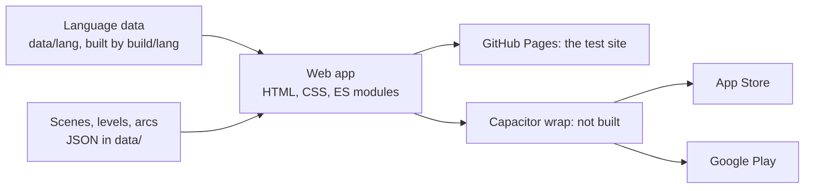

# Nani jo Ghar: technical plan

*How the app is built and how it reaches the stores. Written 22 Sept 2026; rewritten 6 Oct 2026 to match the code as built. The detail is in `target-model.md` (the layers), `code-map.md` (the files) and `shared-api.md` (the modules).*

## Architecture

One codebase, three outputs: a website (GitHub Pages, `main` is live), an iOS app and an Android app (a Capacitor wrap of the same files, not built yet).

**No backend.** Nothing is sent anywhere (J1). Content, art and audio ship bundled in the app. There are no accounts, uploads or analytics; speech recognition runs on the device.

**A local profile per player**, in the one save (`js/core/save.js`, localStorage, schema 2), so Isa and a cousin sharing a tablet each keep their own progress. Nothing else touches storage (J3, B17).

**Plain web technology.** DOM and SVG for every mode, Phaser (`js/vendor/phaser.min.js`) for Cook only. ES modules loaded through an import map that `build/bump_version.py` writes and stamps; no bundler, no TypeScript build (`target-model.md` § 10). The code is four layers: the engine core, the shared framework, content as data, and modes as plug-ins.

**The language engine.** Every word and line comes from the engine, not from game code (G9, G26, G27): a lexicon, word classes (paradigms), abstract meanings and a Kutchi concrete grammar, as data in `data/lang/`, run by a small general JavaScript linearizer in `js/core/lang/engine/`. A game asks for a meaning and gets a sentence plus a clip plan, or a gap with an honest placeholder. The engine's design is `docs/language/engine-design.md`.

**Lazy loading.** A mode loads its own scripts, styles and art when it is first opened.

## Screens and devices

**Landscape only.** Every scene is a wide illustration with the sidebar docked on the left (about 22%, F4); portrait shows one wordless "please turn your phone" card.

**Built to scale, phones to tablets** (decision 24). One frame (`js/shared/frame.js`, `data/layout.json`) picks phone, tablet or laptop and writes every size from tokens; the stage (`js/shared/stage.js`) fits each scene's 1600×900 background to any screen with no letterbox (F18); text shrinks, then wraps (F7). Tablets use extra space for bigger play items; Cook's station layouts for tablets are not done yet (CK-TAB-01).

| Device | Handling |
|---|---|
| Phone | the baseline: 844×390 main, 800×360 the tightest |
| Tablet | scaled sidebar and text; 1024×768, 1180×820, 1366×1024 are in the screen matrix |
| Touch targets | at least 48 px, even when the picture is smaller (F2) |
| Safe areas | notches and home indicators respected |
| Older devices | the cut-off is set by the market (decision 26): iOS 15+ with a module shim (not vendored yet), Android 7+, a cheap-phone performance budget (not measured yet) |

## Data model

Two halves. **Content** ships inside the app and is the same for everyone. **Device state** lives only on that phone.

**Content.** The language engine's data (`data/lang/`: `lexicon`, `paradigms`, `abstract`, `concrete`, `params`, `clips`; nouns carry gender, singular and plural, G13, G18); `data/family-audio.json` (every recording: speaker, file, meaning, OK or ??); scenes with measured positions (`data/scenes/`); each mode's levels and games; arcs (`data/arcs/`); the map and unlock rules; the economy (pay and prices).

**Device state**, one save with one namespace per owner (`target-model.md` § 3.4):

| Namespace | Holds |
|---|---|
| `words` | per word, `understand_stage` and `produce_stage` (1–5; up a stage on correct recall from the Kutchi, down after two misses, G23) |
| `wallet` | the one purse and owned upgrades |
| `ui` | personal bests, onboarding "seen" |
| `story`, `shelf` | the story log and the bookshelf: one named book per finished arc (decision 4) |
| `character`, `speech`, `conversations`, `<mode>` | the player's look, voice enrolment (features only, never audio), Conversations, each mode's own state |

**Why progress is per word, not per level.** A word's stage is read every time it appears anywhere in the game and decides how much help it gets (`Progress.support`). Comprehension comes before production, so `produce_stage` never runs ahead of `understand_stage`.

**Profiles carry "can read" and "can type"** flags set by an adult (neither is a difficulty setting, neither is inferred from age).

**Sentences are built, not stored.** The engine builds each sentence from recorded words; the most frequent phrases are recorded whole after a simulated run, and until the pre-publish pass whole-phrase clips are switched off so the engine is tested everywhere (decisions 13, 26; G12). Recordings never change the engine.

## Pipelines

Three belts, each turning family-made material into bundled assets.

**Language: Mum's answers to data.** Mum's rounds and recordings are processed with the `/mum-round` skill (`build/tools/ops/mumround.mjs`): transcribe, cut and normalise clips, index them, then feed every fact into the engine first (G27, decision 40). `build/lang/import_all.mjs` rebuilds `data/lang/` from the hand-edited seed and the other sources and reports the gaps (`data/lang/reports/gap-list.md`), which become the next round's questions (`mumsheet.mjs`).

**Audio: recording to bundled files.** Mum records long takes saying question ids; Zafar marks every clip OK or ?? in `lab/family-audio.html`; only OK clips ship. Computer voices are test-only on Pages and never ship (G14); the store app plays family clips only.

**Art: ChatGPT to cut-outs.** Art is made in ChatGPT through Claude in Chrome from one ready-to-paste block (D1, D3; the `/art-run` skill, `docs/design-language/art-pipeline.md`); a flat magenta ground for food, grey for steel, glass, wood and characters, then keyed and cut by `build/tools/art/artcut.py`, judged by `artjudge.py`, and committed to `sources/art/<pack>/` on `main`. Backgrounds are 1600×900.

## Release path

| Stage | What it is | State |
|---|---|---|
| GitHub Pages | the test site: `main` is live, labs included | live |
| Home screen PWA | a manifest and a small offline service worker | not built (no manifest or service worker in the repo) |
| Capacitor wrap | the same files packaged as a native app; family clips only | not built (`build/package.mjs` planned) |
| App Store | Kids or Education category; Apple Developer Program, about £79 a year | to do |
| Google Play | Designed for Families; one-off $25 | to do |

**Kids category rules** are already reflected in the design: no third-party analytics, no ads, no accounts, a privacy policy; because nothing leaves the device, the policy is short and true.

**Apple's thin-wrapper rejection** does not apply: images, audio and logic are bundled and the app works offline once wrapped.

**First release.** Arc 1, *The Birthday*, finished end to end, is the release candidate; the store launch carries Arcs 1–5 (H36–H41). The commercial model is open (decision 7). The current plan and what is next are in `docs/status.md`; the sprints are in `docs/sprints/`.
