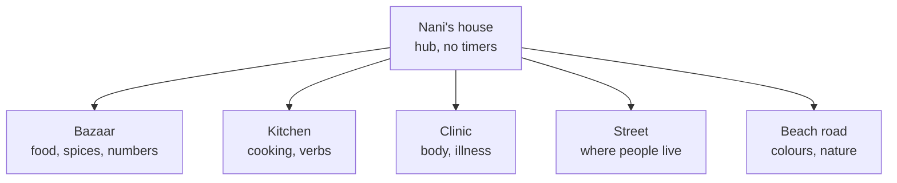

# Story and arcs

> **Stale points (what `docs/process/rules.md` now overrides).** Source blocks are copied word for word and not corrected.
> - Eid arc, "Eid morning", "The spill", the wedding, the shoe mountain and the five-arc plan → the Birthday arc, day-out trips, clinic, Making clothes with Big Ma, Monsoon, Who did it (H36–H39)
> - Quilt, patches and "the finished quilt = the finished game" → a bookshelf, one named book per finished arc (decision 4); quilt-making becomes a Big Ma arc
> - Stars and the ear/voice star → three badges (H5, decisions 1–2)
> - Pocket money "given at Eid", functional purchases, shop prices → decision 10
> - "English one tap away", gist captions and subtitles → no English for the child (E1, F23); the light bulb is the help (decision 1)
> - *hikdo/bo/trae* as the tap counts → *hakro/hakri* by gender, *ba*, *trae* (G5, G6); *daal* → *daar*; *mishkaki* as the dish → *sekelo* (H20)
> - "Platform decisions: move to a private host before recordings go in" → everything stays public until launch (decision 6)
> - Chapter 1 Eid dressing (lantern, bunting, fairy lights, crescent and star) → re-home to the Birthday arc (H36)

The story spine for every mode: Nani's role, how the story is told, the arcs, and the syllabus that decides which language each stage teaches. Modes' own story homes live in their files in `docs/game-design/modes/`; scoring and unlocks are in `progression-and-scoring.md`.

## Part 1. Story structure (Roadmap and Story Structure)

> from: docs/archive/design-v1/Roadmap and Story Structure.md § Nani's role

### Nani's role

**Nani is the child's guide**, not a character confined to her kitchen (decided 28 Sept 2026). She helps the child learn, grow and explore, and she appears everywhere: cooking, travelling, the clinic, the sewing room, and the fire at the end of every arc. The kitchen is still home base and still teaches the most words, but it's her house, not her cage.

> from: docs/archive/design-v1/Roadmap and Story Structure.md § Story structure: the levels of granularity

### Story structure: the levels of granularity

| Level | What it is | Example | Progress object |
|---|---|---|---|
| **Story** (arc) | A whole season with a finale | *The Birthday*: guests arrive, food is cooked, the table is set, the sweets are found and packed, the candles are blown out | Finishing it completes a quilt |
| **Chapter** | One event in the story with its own goal, complication and payoff | *The guests are coming*, then *The cat and the sweets* | One quilt patch per chapter |
| **Errand** | One play session, 5–8 minutes. This is "the level" | *Cook each guest's order*, *Set the table*, *Find the sweets* | Words mastered go into their container |
| **Game mode** | A reusable mechanic that errands are built from | Shopping, put-it-there, hide and seek, cook-along, at-the-door, ask-around, spot-it, body/dress | None of its own, see Game modes below |
| **Container** | A long-running collection that fills as words are mastered | Nani's pantry (food), the spice cupboard, the sewing kit (colours/threads), the wardrobe (clothes) | Is the progress |

**Two kinds of progress, deliberately split:** containers track **words** (a mastered word stays on the shelf for good), the quilt tracks **story** (one patch per chapter).

**Learning tree:** each domain has its own levels (Kitchen 1–5, Sewing 1–5, Wardrobe 1–5, Family 1–5), driven by the per-word stages of the words in it. Long term: the player composes their own recipe from ingredients they know, and later says what they like to eat.

**Storytelling principles:** alternate pace (calm kitchen, busy bazaar, curiosity, mild tension); every chapter has a goal, a complication and a payoff; each chapter opens a place and fills a container; recurring characters carried across every arc; events cause the next errand rather than errands being handed out; **consecutive errands never repeat the same main action**, so each one feels like a new thing to do.

**Cost to keep in mind:** each story event needs a background, characters, and recorded sentences. The family's recording time is the real limit on pace, so the story reuses places and characters heavily.

> from: docs/archive/design-v1/Roadmap and Story Structure.md § How the story is told

### How the story is told

Many players can't read, and the Brief rules out cutscenes, so the story is carried by **what you see and hear, never by text you must read.** Understanding the story is a bonus; the task itself never depends on it.

#### Three channels, in order of importance

| Channel | What it carries | Who it reaches |
| --- | --- | --- |
| **Picture and action** | What changes in the world: a lantern goes up, the empty bowl on the island, the pot on the stove, the guests' shoes piling up by the door. Nani points and gestures | Everyone, including a four-year-old |
| **Sound** | Nani's voice in Kutchi, a knock at the door, a bubbling pot, market chatter | Everyone; the Kutchi is the teaching |
| **Text** | A short English gist caption ("Eid is tomorrow and the guests are coming!") and the Kutchi subtitle, in the speech bubble | Readers only, and the adult sitting with a child |

#### Story beats

Each errand opens and closes with a **beat**: 3 to 5 seconds, one visual moment, one Kutchi line from Nani, one gist caption. Skippable with a tap, skipped automatically on replay. It's a moment inside the scene, not a cutscene: the player is already in the kitchen, and Nani does something.

Story lines are recorded like any other sentence. Until the family has given the Kutchi, a beat shows the gist caption only, with no audio. Never invented Kutchi.

#### The hub fills up with the story

The kitchen is the hub, and it **changes as the story moves**: decorations build up errand by errand (for the Birthday: balloons, then streamers, then the laid table, then the cake), and the same idea carries into every later arc (a day out leaves a souvenir on the shelf; the clinic arc adds a certificate; a day's sewing adds a finished garment to the wardrobe). A returning player sees at a glance where they are in the story without reading anything. This is the cozy-game principle: progress shows up as a changed place.

#### Arc 1's beat script: TBC

The Birthday's own beat-by-beat script (what you see, what Nani says, the gist caption, for each errand) is written the same way as the worked example that used to sit here for the old Eid chapter — see "Replaced 28 Sept" below for that example's shape. It's written once the guest dialogue for Cook's ordering round is confirmed with the family, so it isn't duplicated here yet.

**Every arc's last beat is the Story by the Fire** (decided 28 Sept 2026): a short scene of Nani by the fire in the living room, then a picture book built from what the child actually did that day, which she voices while the child fills in gaps. It replaces a plain "chapter end" beat wherever an arc or chapter finishes. Full design: `docs/game-design/modes/story-by-the-fire.md`.

> from: docs/archive/design-v1/Roadmap and Story Structure.md § Story arcs

### Story arcs

**Reworked 28 Sept 2026.** The sequence is now: the first launch, then **Arc 1: The Birthday**, then a run of **day-out trips** (a repeatable template, new places each time), with two **standalone, repeatable arcs** — Volunteering at the clinic and Making clothes with Big Ma — slotted in once the day-out template is established. Eid moves to a later arc (there's more to explain about it, so it suits a more prepared player). See "Replaced 28 Sept" at the end of this section for what the old five-arc plan looked like and what became of its content.

#### Arc 1: The Birthday (the MVP, syllabus stages S1 + S2)

A birthday party at Nani's house. Every errand still has a different main action, in the order a real party goes, so a new player's first impression is several different things to do, not one thing twice.

| Chapter | Goal → complication → payoff | Errands (mode) |
| --- | --- | --- |
| The guests are coming | Guests are due → nothing's ready → each guest fed, the table set | Cook each guest's order (Cook: each guest asks for their own dish by name, like Cook's existing customer flow). Set the table (Put it there: place words for plates, cups, a spot for each guest) |
| The cat and the sweets | The mithai's out → the cat scatters it | Find the sweets (Hide and seek). Pack the sweet box (Put it there, with counting: the right number in each layer) |
| The party | Everyone's fed and seated | Blow out the candles (a short finale beat), then the Story by the Fire |

**Explicitly dropped from Arc 1** (decided 28 Sept 2026): clothes-making (it's now its own standalone arc, Making clothes with Big Ma), greeting guests at the door (folds into the Conversations module's Knock-knock chain instead, later), and the shoe mountain.

Arc 1 needs Cook (already built) and Put it there and Hide and seek (both still to build), the same mode set the old Chapter 1–3 needed, so the build cost doesn't change.

#### Arc 2 onward: "A day out with Nani" (a repeatable template)

Each arc from here is a trip, built mostly from existing modes, with new words each time. The template, in order:

1. **Pack your bag** — a small fetch-style round (shaped like the pantry round), different items each trip.
2. **Cook your packed lunch** — Cook, reusing its stations.
3. **Travel** — by bus, car or motorbike. One new game: **spot it out of the window**. The only new art is the view out of the window; Nani says "spot the …", and the child taps things as they pass. **Decided 29 Sept (Zafar):** keep it simple, like the clinic's pharmacy belt (the window is the belt): no camera and no aiming here.
   - **Snap at every destination (decided 29 Sept, Zafar).** At each place, the child is first shown a few items with their words (the shot list), then finds and snaps them in the scene with Snap's viewfinder (`docs/game-design/modes/snap.md`, engine and greybox built). The photos feed the album and the Story by the Fire. This is Snap's home now, replacing the old village arc.
4. **A food stall at the place** — three Cook-style mini-games (for example, at the beach: corn on the cob, mishkaki, fried doughnuts).
5. **One or two place-specific games** — for example the beach's sandcastle and kite.
6. **The Story by the Fire** — every arc's ending (see below and `docs/game-design/modes/story-by-the-fire.md`).

**First trips to sketch**, in the order Zafar gave them:

| Trip | The stall (3 Cook-style games) | Place games | Vocabulary (English; all Kutchi to record) | Art needed |
| --- | --- | --- | --- | --- |
| **The beach** | Corn on the cob, mishkaki (already in the game), fried doughnuts | Build a sandcastle; fly a kite; collect shells | sand, sea, wave, shell, bucket, spade, kite, sun hat, towel, swim | New background(s); sandcastle and kite art; the beach stall's three dishes |
| **The garden / farm** | Fresh vegetables from the patch; a farm lunch; fresh milk | Feed the hens and goats; find the chicks | hen, goat, chick, egg, feed, fence, vegetable patch, watering can, dig, plant | Reuses the existing hen/goat/chick character art; new background(s) |
| **The safari** | Local food-stall snacks (TBC with the family) | Spot the animals from the jeep (the trip's own "spot it" moment, doubled up with travel); a photo game | jeep, binoculars, lion, elephant, giraffe, zebra, watering hole, camera | New animal art, a safari background, a jeep |
| **The boat** | Fresh fish, coconut water, a stall snack (TBC) | Fishing; spot things in the water | boat, oar, life jacket, fish, net, jetty, wave | A boat, a jetty/harbour background, fish art |

These are a first sketch, not locked: exact stall dishes and games are confirmed with the family and against what art already exists before each trip is built.

**The cross-arc vocabulary spine.** Some words appear on every trip regardless of destination, and are taught once, then reinforced everywhere: the bag's contents, travel verbs (go, arrive, look, point), numbers and colours (carried over from Arc 1), and the Conversations module's thanks/greetings/well-being exchanges, which every new person met on a trip can use.

#### Standalone, repeatable arcs

Two arcs that aren't day-out trips, placed into the sequence rather than tied to one story spine:

- **Volunteering at the clinic.** Nani introduces it after the child's first or second day out. Across the arc's run the child helps 4–5 patients; it teaches body parts and uses all of the clinic's existing mini-game designs (`docs/archive/clinic/clinic-design-v1.md`).
- **Making clothes with Big Ma.** The Dress up mode's home (`docs/game-design/modes/dress-up.md`), placed later in the sequence once a story reason for new clothes comes up (a trip, an occasion). Exact placement is TBC.

Both are repeatable: like the day-out template, they're built once and replayed with new patients or new garments.

**Two more, proposed 29 Sept (Zafar: "Monsoon and Who did it sound like arcs in their own right").** Both modes already have a full design with many mini-games, like Cook and the clinic, and an engine plus a greybox lab (about 17% each). Placement and story TBC; not scheduled before the first trip.
- **The monsoon** (Monsoon rush, `docs/game-design/modes/monsoon-rush.md`): the rains arrive at Nani's in Kutch. Nani's forecast, bring everything in, the animals into the shed, the kitchen leak, dry off, chai for everyone.
- **Who did it?** (`docs/game-design/modes/who-did-it.md`): a mystery arc. Something's missing, gather clues (look closer, follow the prints), the sofa line-up (keep who fits, ask, tell Ali, Nani guesses), accuse and prove it, the comic reveal, sorry and goodbye. Its sweets case (`who.html?case=a1c3-sweets`) could still be a small culprit round after Arc 1's Find the sweets, but only once its describing words and past-tense frames are recorded (almost all are placeholders today).

#### Eid: moved later

Eid is no longer Arc 1. It becomes its own arc later in the sequence, once the day-out trips and the two standalone arcs have built up enough vocabulary and story weight to carry it properly. Not yet designed.

**Known follow-up:** the first launch's own story hook (`docs/game-design/modes/first-launch.md`) currently ends with Nani saying "Tomorrow is Eid, guests are coming" to lead into cooking. That line now needs to lead into the Birthday instead. Not changed in this pass — flagged for whoever next touches the first launch.

#### Replaced 28 Sept: the earlier five-arc plan

The previous plan (23 Sept) was five arcs as a grammar ladder — Arc 1 *Eid at Nani's* (S1–S2), Arc 2 *The Wedding* (S3), Arc 3 *The Monsoon* (S4), Arc 4 *Nani's Lost Ring* (S5), Arc 5 *Nani's Village* (S6) — about five chapters each, roughly 50 errands in total. The full chapter-by-chapter detail is in git history (this file, before 28 Sept 2026); the shape of it, for reference:

| Old arc | Was about | Its content's new home |
| --- | --- | --- |
| Arc 1: Eid at Nani's | Guests coming, cooking, the table, a spill, Eid morning | Split: the cooking/table/sweets beats became the Birthday; Eid itself moves later; the spill and Big Ma's mending became the Making clothes arc's kind of story |
| Arc 2: The Wedding | Kinship, colours, outfits, a gift quest, the feast | Kinship and the gift-asking pattern fit the cross-arc vocabulary spine; outfits fit Making clothes; the feast's serving-in-order pattern fits any trip's food stall |
| Arc 3: The Monsoon | Weather, illness, farm animals sheltering, chai | The clinic content becomes the standalone clinic arc; the farm-animal content fits the garden/farm trip; weather could become a future trip variant |
| Arc 4: Nani's Lost Ring | Past tense, a search, asking around | Not carried forward yet; a mystery chapter could return inside a future trip |
| Arc 5: Nani's Village | The farm, the journey, family photos, Nana's stories | The farm and journey became the garden/farm and travel template; family photos and Nana's stories fit any trip's Story by the Fire |

The syllabus's S1–S6 grammar stages (below) still hold as a ladder; which trip or arc carries which stage is TBC and gets settled as each trip is actually built, rather than fixed in advance the way the old plan fixed it.

> from: docs/archive/design-v1/Roadmap and Story Structure.md § Syllabus

### Syllabus

#### Grammar forced by Kutchi itself

1. **Every noun has a gender, and other words agree with it.** Gender and plural are fields on the Word entity, filled in by the family with the word itself.
2. **Positions come after the noun**, as in Hindi, Gujarati and Sindhi. Each hotspot's place phrase is one self-contained recording.
3. **The past tense is the hardest part.** In transitive perfective sentences verb agreement can go partly missing, and with a first-person singular subject the verb may agree with the object. So intransitive past tense comes before transitive.

Worth checking with the family: in the closely related Kutchi Gujarati, "like" and "have to" take a "to me" subject. The frame *Muke … khape* looks like the same pattern, so "I need / I like / I have to" are taught as fixed chunks from the first session.

#### Sizing it

Cambridge's Pre A1 Starters expects over 500 words and A1 Movers adds roughly 400 more. For a home language the target is **roughly 400 words plus about 40 sentence frames**.

#### Six stages (internal, never shown to players)

| Stage | Can-do | Grammar and frames | Vocabulary domains | ~New words | Carried by |
| --- | --- | --- | --- | --- | --- |
| S1 Arrive and fetch | Greet, understand a request, count what's asked for | Greetings; "I need X"; "give me X"; number + noun; yes/no | Greetings, numbers 1–10, fruit, veg, spices, staples | 60 (first release) | Arc 1: The Birthday |
| S2 Do as Nani says | Follow two-part commands, put things in places | Imperatives; position phrases; this/that | Rooms, household objects, utensils, clothes (nouns), colours, sweets and dishes | 80 | Arc 1: The Birthday, then the early day-out trips |
| S3 Who's who | Name family, ask simple questions, say likes | Possessives; who/what/where/how many; "I like" chunk; adjective agreement | Kinship, people and jobs, jewellery, sizes and shapes, basic adjectives | 70 | TBC: likely Making clothes with Big Ma and/or the clinic arc |
| S4 How I feel | Say what hurts and how you feel | Present and habitual; "it hurts"; "I'm cold"; "it's raining" | Body, health, feelings, weather, times of day, farm animals and birds | 70 | TBC: likely Volunteering at the clinic |
| S5 What happened | Follow and retell a simple event | Past tense, intransitive then transitive; yesterday/today; first/then | Actions, materials, household (extended), place words | 60 | TBC: a later day-out trip |
| S6 Tell and plan | Describe people, compare, say what will happen | Future; comparatives; "because"; short narrative | Nature, travel, places, describing people, cultural and religious life | 60 | TBC: a later day-out trip, or Eid |

**This mapping is provisional** (28 Sept 2026 rework): the old plan fixed one arc per stage; the new plan fixes the *trip template* and lets each trip's vocabulary and grammar load settle as it's actually built. Revisit this table once two or three trips exist.

Two strands run through every stage: **numbers** (1–10 in S1, larger with prices from Arc 2) and **respect language** (formal and familiar "you", honorific kinship titles).

Chapter 1's restructure pulls a little S2 forward (the dastarkhwan's position phrases and tableware nouns). That's fine: they are heard in context and only need recognising, not producing.

#### Gaps and fixes

| Gap | Fix |
| --- | --- |
| Times of day and days | TBC which trip opens with Nani's day: morning chai, midday, evening lamps |
| Money | A future trip's food stall or shop, adding coins to the quantity mechanic |
| Jobs and people | The safari and boat trips bring in the driver, the guide, the boatman |
| ~150 to 200 story-carried words against a ~400 target | Generated side errands (Nani's everyday requests) carry the long tail; adaptive pacing lets faster players clear it sooner |

## Part 2. The world (Game Design)

> from: docs/archive/design-v1/Game Design.md § The world

### The world

Hub and spokes. Nani's house is the hub and it is always calm: no timers, no failure, nobody hurrying you. Everything outside it is a spoke holding one area of vocabulary.

**How it opens.** One spoke at a time, unlocked by the errand that needs it. The map is never a wall of locked doors, because a place you cannot go to simply is not drawn yet. The world grows rather than unlocking.

**Semi-open, not open.** Once a place is known you can walk back to it whenever you like and buy things with pocket money, or take on a small side errand. But there is always one lit path: whatever Nani wants today. A child who does not want to choose never has to, and an adult who wants to wander can.

**Travel is two taps.** No minigame between locations. That is the shortest route to bloat.

**People live here.** The relatives from the family unit are not a vocabulary list, they are residents. Masi is at the beach road, Mama runs a stall, Fui is next door. This is what makes the blanket quest work, and it means kinship words are learned by visiting people rather than by tapping faces on a chart.

> from: docs/archive/design-v1/Game Design.md § Scene catalogue

### Scene catalogue

The teacher's Unit 1 to 9 sequence is already a curriculum built by someone who teaches this for a living. It is used as the spine, with a game mode against each unit.

| Unit | Vocabulary | Scene | Mechanic |
| --- | --- | --- | --- |
| 1 | Numbers | Woven through everything | Quantities at every stall |
| 2 | Greetings, how are you | The doorstep | Who is knocking, and how you answer |
| 3 | Family, jobs | The street | Visiting relatives, who does what |
| 4 | Actions | Charades in the yard | Tap the person doing what she says |
| 5 | Body, illness | The clinic | Find out what hurts, fetch the medicine |
| 6 | Food, drink, meals | **Bazaar** and kitchen | Shopping list, then cooking |
| 7 | Prepositions, where you live | Hide and seek | Put the cat behind the door, on the roof |
| 8 | Journey, colours, nature | Beach road | Spot what she names as it goes past |
| 9 | Getting ready, visiting | Pack the bag | Timed hunt for socks, shoes, sweets |

Two scenes deserve spelling out.

**The bazaar** is the first build. Nani names what is missing, the pantry turns it into a list, you go to the stall, the seller asks what you want and how many, and you come home and hand each thing over. It teaches food, numbers and the shape of a transaction, and it is the template every other scene is a variation on.

**The blanket quest** is the second build, and it is the most complete idea in the design.

1. Nani is making a quilt and needs coloured thread. She does not know which colours.
2. You go round the family asking each person their favourite colour. Masi, Mama, Fui, Dada. Each answers in Kutchi and shows you the colour.
3. Each answer writes itself into your notebook, next to that person's face.
4. You take the notebook to the bazaar and buy the threads, which means reading back what you wrote.
5. You bring them home and Nani asks for each colour in turn. You pick from your basket.
6. The quilt gains a patch made from those colours.

One quest, and it carries kinship terms, colours, asking a question, reading back, and a recall drill at the end. The reward is an object that stays on the wall, made of the colours the player's own relatives chose. It is worth building early because it proves the whole design: teaching by doing, spaced repetition disguised as a task, and progress you can see.

## Part 3. The syllabus-first table (game-modes-v2)

> from: docs/archive/design-v1/game-modes-v2.md § §1 What the syllabus demands

### 1. What the syllabus demands

| Stage | Language to teach | Kind of game that *forces* that language |
|---|---|---|
| **S1 Arrive and fetch** | Greetings, "I need X", "give me X", number + noun, yes/no; fruit, veg, spices, staples | Fulfilling requests; finding named things; counting out |
| **S2 Do as Nani says** | Imperatives, **position phrases**, this/that; rooms, household objects, utensils, clothes, **colours**, dishes | Following commands with verbs; placing things *where* told; picking by colour |
| **S3 Who's who** | Kinship, possessives, **who/what/where/how many**, "I like", **adjective agreement** | Serving the right person their preference; identifying people from descriptions; dressing to a description |
| **S4 How I feel** | Present and habitual, "it hurts", "I'm cold", weather; body, feelings, times of day, animals | Treating patients; reacting to the weather; routines by time of day; animals |
| **S5 What happened** | **Past tense**, yesterday/today, **first/then**; actions, materials, place words | Solving "who did it"; ordering events; following recipe sequences |
| **S6 Tell and plan** | **Future**, **comparatives**, "because", describing people, nature, travel | Packing with size and weight rules; spotting and describing; planning |
| **Running through everything** | Numbers (larger from Arc 2, with prices), respect language (formal "you", honorific kinship) | Money in every shop and upgrade; greeting each character correctly |

---

## Part 4. Chapter 1 Eid dressing: the story mapping (Chapter 1 Art Prompts)

> from: docs/archive/art-prompts/Chapter 1 Art Prompts.md § 7 Eid decorations sheet (the story-mapping part)

**Why this sheet:** the hub gets dressed a little more after each errand (see "How the story is told" in the Roadmap). In kitchen v3 these hang from or run along the top shelf, the Eid shelf. The bunting must carry no letters: text never lives in an image.

**Review of the kept image (23 Sep 2026), and how it's used.** Passes every reject check: no text or letters anywhere, including on the bunting.

| Area | Decision |
| --- | --- |
| **Anchor points** | Lantern and the crescent/star both hang from visible chains, giving a natural point to anchor them from the eid_shelf in scene JSON |
| **Legibility** | All six read clearly at small size, checked against the hub's actual scale |
| **Fairy-light glow** | The bulb glow has blended into the magenta key colour at the slicing step. Needs a clean cut plus a code-added glow effect (same class of fix as the known `item-vermicelli.png` magenta-fringe defect in the Asset Naming Convention doc), not a regeneration |
| **Bunting length** | Only 3 flags, too short to span a shelf edge on its own. Tiled/repeated in code along the shelf edge with varied flag colours, rather than regenerated wider |
| **Story mapping** | Lantern → Errand 1 intro beat. Bunting → after Errand 1 (patch 1). Fairy lights → after Errand 2 (patch 2). Crescent and star → end of Chapter 1. Dates → Chapter 2. Prayer mat → held back for Chapter 5, Eid morning itself, rather than used as kitchen dressing now |
