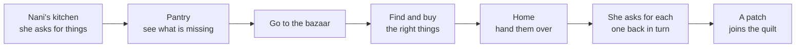

# Vision

> **Stale points (the rulebook, `docs/process/rules.md`, wins).** Blocks below are copied word for word from the Project Brief (22 Sept) and Game Design (23 Sept); these lines are overridden:
> - "Not a business. No ads, no subscriptions … free" → **commercial model open**: Zafar's £2/month idea (first arc free) and "free to the community" both stay open (J5, decision 7).
> - "A quilt that fills in" / "the quilt, with patches earned" (principle 8, scope) → **a bookshelf**: at the "book end" review with Nani the arc's book goes on the shelf, name on the spine; quilt-making is a Big Ma arc (I14, decision 4).
> - "Points, stars or XP" / "stars" → scoring is the **three end-of-round badges: time, accuracy, hints** (H5, J7, decisions 1–3).
> - Principle 4 "English is available … gist caption, text one tap away on any word" → **no written English for the child, ever**; the light bulb is the help and costs a bulb; spoken English only in story mode (E1, E25, non-negotiable 5, decision 12). Game Design's "subtitles … in English" likewise.
> - Principle 7 / Game Design "Nani's house has no timers, ever" → Cook has level timers (open question about a relaxed mode); timed runs are still opt-in where the design says so.
> - Principle 11 "adding the fifth scene should mean filling in a spreadsheet" → content model first stands (J4), but the spreadsheet's role is open (see `language/lexicon.md` § The Excel's role).
> - "Scope of the first release: one room and one stall, 60 words, the quilt" and "Out of scope: the clinic, the beach" → stale; the repo has Cook, the clinic and six parked modes. The first release candidate is Arc 1, The Birthday, finished end to end (H36–H39). Current plan: `docs/status.md`.
> - "The hub is Nani's house … the bazaar, the kitchen, the clinic and the beach road" and "Nani … a character confined to the kitchen" → Nani is the child's guide everywhere (Zafar, 28 Sept).
> - Game Design's "pocket money at Eid", "functional purchases: extra seconds, hints" → pocket money rewards doing well, by volume × quality × difficulty; upgrades never do the listening for you (decision 10, H-rules in §4 Feedback, scoring and rewards).
> - Game Design's "Art direction" (cel shading, thick outlines) → the stylised 3D look, no outlines (D13, D16).
> - "Hikdo, bo, trae", *daal*, *nar* and the like in copied examples → G5 (*hikdo*, *bo*, *nar*), G4 (*daal*).
> - "Everything is audio-first … Timers: adult on by default" age table: the difficulty model stands; specifics change with each mode's design.
> - "Grandparent mode is the one to protect" is **not in rules.md**; it is carried here as a design intent, status unconfirmed (see "Open questions").
> - "Avoid entirely: … speech recognition" (game-modes-v2 §5) → every mode has closed-set speaking moments (`game-design/speaking.md`); recognition is on-device only (J1).
> - Kutchi examples for Mum's recording: one family's Kutchi, romanised only (G4).

The pitch, who it is for, what success looks like, the pillars that break ties, and what we will not do. The rules themselves are in `process/rules.md`; the pillars here are the reasons behind them. The working agreement is in `CLAUDE.md`.

## Zafar's aim

> from: docs/archive/handovers/NEXT-CHAT-START.md § 1. Zafar's aim (his words, 30 Sept)

> "A beautifully organised, clear, logical, modular, scalable code base that modern agile software development would class as best practice, which allows quick development, which allows global changes to take place rapidly, which allows this review system to work much better: you can play the game inside your test sandbox and have a checklist (words clipping, spacing, padding, all the standard things)."

> "There should be one tightly reviewed, not too long rule set… some of these rules I'm giving you throughout the whole thing then need to be in one place, and the reviews need to be in one place."

> On the language engine: build it properly: "the lexicon, the morphology rules, the syntax rules… once you understand the grammar you can create sentences from the rules… if you need to know how to say 'make me rice and curry' you just need to ask to fill in the words for rice and curry and you should know how to say the rest."

## The pitch

> from: docs/archive/design-v1/Project Brief.md § What we are building

A Kutchi language game, played on a phone or tablet, in which you walk around a small Kutchi world and complete tasks for the people in it.

The hub is Nani's house. From there you go to the bazaar, the kitchen, the clinic and the beach road, each holding one area of vocabulary. Tasks are given in spoken Kutchi and completed by acting on them: fetch these things, find out who is ill, bring back the right colour threads. Every voice in the game belongs to a real family member.

It is built once as a web app and wrapped for the App Store and Google Play, so the same work produces a website, an iPhone app and an Android app.

> from: docs/archive/design-v1/Roadmap and Story Structure.md § Nani's role (the current shape: modes, arcs and Nani as guide)

**Nani is the child's guide**, not a character confined to her kitchen (decided 28 Sept 2026). She helps the child learn, grow and explore, and she appears everywhere: cooking, travelling, the clinic, the sewing room, and the fire at the end of every arc. The kitchen is still home base and still teaches the most words, but it's her house, not her cage.

> from: docs/archive/design-v1/Game Design.md § The core loop (the shape of one errand; the diagram's quilt step is stale, see the box)

A session is one errand, start to finish, in five to eight minutes.

The shape matters more than the setting. Every scene in the game, now and later, runs this same loop: an instruction in Kutchi, a journey, an act of recognition under some pressure, a return, and a short recall at the end that quietly repeats the words you were weakest on.

The final step before the reward is the one doing the teaching work. Nani asking for each item back in turn, and you picking it out of your basket, is spaced repetition wearing a grandmother's voice. The player experiences it as putting the shopping away.

## Why it exists

> from: docs/archive/design-v1/Project Brief.md § Why it exists

Kutchi is a spoken home language with no standard written form, and the generation that speaks it well is the grandparents. The pattern repeats across the diaspora: grandparents fluent, parents partial, children almost none.

Four reasons this gets built:

1. Zafar would use it himself. Duolingo streaks past a thousand days did not produce speech, and apps like Praktika start too advanced for a partial speaker.
2. Isa will use it, and so will his cousins.
3. It gives Zafar's mother a structure for teaching the grandchildren, rather than having to invent lessons.
4. It is a project Zafar and his mother build together.

Nothing adequate exists. A Freelang wordlist, a paid uTalk course, an iOS phrasebook and a flashcard app, none of them playable by a six-year-old and none built around one family's own Kutchi.

There is no Kutchi speech recognition and no Kutchi voice synthesis, from any vendor. That is a constraint on the design and, later, an opportunity: an app used by enough families becomes the first real corpus of spoken Kutchi.

## Who it is for

> from: docs/archive/design-v1/Project Brief.md § Who it is for

Three audiences share one app. They are served by the same screens, not by separate modes.

| Audience | Who | What they need | What breaks it for them |
| --- | --- | --- | --- |
| Children 4 to 11 | Isa, his cousins, community children | Play, repetition, warmth, visible progress | Timers everywhere, losing things, reading-heavy screens |
| Adult heritage learners | Zafar, his generation | To reach useful speech fast, without counting to ten again | Childish padding, slow pacing, no way to skip ahead |
| The teaching adult | Zafar's mother, aunts, grandparents | A structure to teach from, and a reason to be in the room | Being replaced by the app rather than used by it |

The third audience is the one most language apps ignore. Here it is central: the adult who speaks Kutchi is a participant, not a bystander.

> from: docs/archive/design-v1/Game Design.md § Session shape and age fit

**One errand is one session**, five to eight minutes. It ends at a natural point, with a patch, and the game does not ask you to stay. An adult will do four errands back to back; a five-year-old will do one. Both are complete.

**Age fit is handled by the difficulty model rather than by separate content.** There is no children's version and no adult version. The same bazaar is a bright tapping game for a child at stage one and an audio-only recall drill for an adult at stage five.

Where age does change things:

|  | Younger child | Adult |
| --- | --- | --- |
| Reading | Not required anywhere | Written word available until stage three |
| Timers | Off by default | On by default, still optional |
| Session end | After one errand | Keeps going while they want to |
| Failure | Nani says "Arre re!" and you try again | The same, and it stings enough |

**Tone.** Warm, never sarcastic, never babyish. Nani is pleased when you get it right and unbothered when you do not. Nothing in the game hurries, scolds or nags, and there are no notifications.

**Accessibility.** Everything is audio-first, so a child who cannot read plays exactly the same game. Touch targets sized for four-year-old fingers. Subtitles for every spoken line, in English and romanised Kutchi. Colour never carries meaning on its own, which matters particularly in the blanket quest, where each colour is also named aloud and written.

### The personas

> from: docs/archive/design-v1/game-modes-fun-analysis.md § 1. Personas

| | Who | Plays now | What they enjoy in those games | Would they enjoy Nani jo Ghar as currently designed? |
|---|---|---|---|---|
| **Layla, 5** | UK-born, Kutchi grandparents, can't read yet | Sago Mini, Toca Boca, Paw Patrol games, YouTube Kids | Tapping things that react; characters; dressing up; **no way to fail**; doing it again | Tapping fruit into a basket: yes, briefly. **Timers stress her.** She can't read the list, so audio and pictures must carry everything. She plays *with* a parent |
| **Zayn, 8** | Reads English, competitive | Roblox, Minecraft, Subway Surfers, Cooking Fever on a parent's phone | Getting better at something, unlocking, collecting, scores, showing off | "Tap the orange" is **boring** within 2 minutes. Kitchen rush with stars, upgrades and harder orders: **yes**. Needs a skill ceiling and something to unlock |
| **Maryam, 11** | Heritage speaker who understands a bit and is shy to speak | Roblox (*Adopt Me*, *Dress to Impress*), Candy Crush, Stardew Valley | Aesthetics, identity, decorating and customising, cosy routines, friends | **Babyish art is an instant no.** She'd love decorating Nani's house, cooking real family dishes, and the heritage angle. A cosy daily routine and streaks work on her |
| **Zafar, 38** | Parent and learner himself; limited time, plays at night | Puzzle Pirates (loved it), Lemonade Stand and Zoo Tycoon | Mini-games with real depth; optimising; building something up | Needs a mode with depth (kitchen rush), a tycoon-style meta loop (upgrading the kitchen and stall), and the notebook for cramming |
| **Farah, 34** | Mum, rusty heritage speaker, commutes | Wordle, Royal Match, Block Blast, Duolingo streak | A 3–5 minute satisfying session, daily habit, streaks | A daily short puzzle (a word or listening challenge) plus a streak. Won't sit through story beats |
| **Nani, 68** | The grandmother; records the voice | WhatsApp, Ludo King | Seeing the grandchildren speak Kutchi; playing *together* | Grandparent mode, big clear screens, playing alongside a child. Her voice *is* the game |

**What the personas tell us:**
- **Primary target:** ages **6–11 plus the parent sitting with them**.
- **A 5-year-old** needs a no-timer "relaxed" setting and voice-first cues.
- **Adults** need a short daily hook and a mode with depth.
- **No single mode satisfies everyone,** so the lineup needs one *toy-like, forgiving* mode, one *skill* mode with a high ceiling, and a *meta* layer (decorate and upgrade) that ties them together.

## What success looks like

> from: docs/archive/design-v1/Project Brief.md § What success looks like (rules.md J9 holds it in one line)

In order. Each one only matters if the one above it held.

1. **Zafar's mother enjoys recording.** If the first session is fun, the project finishes. If it is a chore, it does not.
2. **A child asks to play it again, unprompted.** One child, twice in a week, is the real signal.
3. **Zafar speaks Kutchi he did not speak before.** Measured by using it with family, not by a score in the app.
4. **Kutchi is spoken aloud in the house more than it was.** Including by the adults, prompted by the game.
5. **Another family asks for a copy.**

> from: docs/archive/design-v1/Game Design.md § Build order

Stage two is the real gate. If the evening spent recording with Zafar's mother is a good evening, this project finishes. Everything downstream is craft.

Explicitly not success: downloads, streaks, daily active users, time in app. Time in app is a cost the family pays, not a benefit. A child who learns forty words in ten short sessions has done better than one who learned forty in fifty.

## Design pillars

> from: docs/archive/design-v1/Project Brief.md § Design principles (see the stale-points box: principles 4, 7, 8 and 11 are amended)

These settle arguments later, so they are worth disagreeing with now.

1. **Difficulty is per word, not per level.** How much help a word gets depends on how many times that player has met that word. There is no beginner mode and no expert mode. This is how one app serves a four-year-old and an adult on the same screen, and it is where spaced repetition lives.
2. **The task is the test.** Assessment happens by acting on an instruction, never by a quiz screen. If Nani asks for two lemons and you bring two lemons, you have been assessed.
3. **No cutscenes.** Teaching happens inside the interaction. Anything that plays at you is skippable.
4. **English is available, but never spoken.** Nani's voice is Kutchi only, always. English exists as a gist caption, and as text one tap away on any word or sentence, but it never arrives in the audio channel unasked. The tap is where the effort happens, and the effort is where the learning is.
5. **Every voice is a real person.** No synthesis, no text-to-speech, no AI-generated Kutchi in the product.
6. **Nothing is ever lost.** No punishment mechanics, no losing items or money for being slow. Pressure creates bonuses, never penalties.
7. **Calm places and busy places.** Nani's house has no timers, ever. Urgency belongs outside the house and is always optional.
8. **Progress is an object, not a number.** A quilt that fills in, not points, stars or XP.
9. **Nothing leaves the device.** No accounts, no uploads, no analytics. Recordings made in the app stay on the phone.
10. **Text is never in an image.** All words are drawn over the art, so any word can change without regenerating anything.
11. **The content model comes first.** The app is a content pipeline with a renderer on top. Adding the fifth scene should mean filling in a spreadsheet.

### Design research behind the game modes

> from: docs/archive/design-v1/Roadmap and Story Structure.md § Design research behind the game modes

| Principle | Finding | Test it gives us |
| --- | --- | --- |
| **Intrinsic integration** | Habgood and Ainsworth found educational games work best when the learning material is delivered through the parts of the game that are most fun to play, riding the flow experience rather than interrupting it; the opposite, chocolate-covered broccoli, uses the game as a reward for doing the learning separately | Could the player win without understanding any Kutchi? If yes, the mechanic teaches nothing and gets cut |
| **Total Physical Response** | Learners first work out commands by watching, then act out novel combinations of already-known words; comprehension comes well before production | Does the mechanic recombine known words into new commands? |
| **Task-based teaching** | TBLT centres on tasks with a non-linguistic outcome where using the language is essential to reaching it | Is there a real goal (a fruit bowl, a found ring) that only Kutchi unlocks? |
| **Narrative load** | Following a story can consume the cognitive capacity needed to learn the material, with young children most at risk | Is the story carried by actions and objects, or by text the child has to read? |
| **Cozy-game progression** | Animal Crossing's progression is relational and environmental; Wylde Flowers adds chapters, character arcs and a central mystery on top of that loop | Does progress show up as a changed place and a closer relationship? |

Sources: Habgood & Ainsworth, *Motivating children to learn effectively* (2011); *Total physical response* (Wikipedia); Breien & Wasson, *Narrative categorization in digital game-based learning* (2021); *The Cozy-Game Craft of Animal Crossing: New Horizons* (2025).

## What we will not do

> from: docs/archive/design-v1/Project Brief.md § Non-goals ("Not a business" is stale: commercial model open, decision 7)

- **Not a CEFR course.** CEFR assumes a standardised written language with formal registers. Kutchi has neither. We borrow its sequencing logic and claim none of its levels.
- **Not a script-teaching app.** Kutchi is written informally in Gujarati or Perso-Arabic script and there is no agreed standard. Romanised spelling only, matched generously.
- **Not a dictionary or a preservation archive.** Those are worthy and they are different projects.
- **Not a business.** No ads, no subscriptions, no growth targets. If it is ever released widely, it is free.
- **Not a replacement for speaking to your grandmother.** The app exists to get more Kutchi spoken between people, not less.
- **Not multi-dialect.** One family's Kutchi, done properly, beats a neutral version nobody recognises. Other varieties can come later as alternate audio.

> from: docs/archive/design-v1/Game Design.md § Mechanics rejected

Written down so they do not get proposed again in six months.

| Rejected | Why |
| --- | --- |
| Double-or-nothing haggling | Losing your money and items for being slow punishes the youngest players hardest, and wager mechanics are the first thing scrutinised in anything aimed at children. The tension moves to the upside instead: be quick and Nani is extra pleased |
| Endless runner between locations | A different game bolted onto this one. Teaches nothing, and it is exactly the padding adults resent |
| Streaks and daily goals | Manufacture guilt, and punish the week someone is ill or away |
| Lives and hearts | Failure should cost nothing here |
| Leaderboards and social comparison | Wrong for a family app, and a privacy problem for children |
| Card battlers, escape rooms | Good mechanics, different app |
| Text-to-speech for Kutchi | Does not exist, and a synthetic approximation would teach the wrong pronunciation |
| Teaching a written script | Kutchi has no agreed standard. Choosing one is the community's decision, not this app's |
| Cutscenes | Passive. Teaching happens inside the interaction or not at all |

One rule behind most of these: **nothing in this game may make a child feel bad.** The game can be hard, and should be for an adult, but the cost of failure is always another go.

> from: docs/archive/design-v1/game-modes-v2.md § 5 Feasibility (the "avoid" line; "speech recognition" here is stale: closed-set speaking moments are in every mode, `game-design/speaking.md`)

**Avoid entirely:** 3D, physics piles (triple-match), multiplayer, speech recognition, full-body character animation.

> from: docs/archive/design-v1/free-play-and-world-ideas.md § 4. Scope assessment (the two rows that say No, and the breadth-before-depth rule)

| Piece | Size | Recommendation |
|---|---|---|
| **Pokémon-style walking world** (an avatar you move around, top-down maps, walk cycles, collisions) | **Large**: a different camera and art style, many more assets, new movement code | **No** for the MVP. A tap-to-travel map gives most of the feeling for a fraction of the cost |
| **Multiplayer / social** (Puzzle Pirates crews) | **Very large** | **No** |

**Biggest risk: breadth before depth.** One genuinely fun mode beats five mediocre ones. Make each mode pass **two tests** before adding the next:
1. **It's fun even for someone who doesn't care about learning** (would a child choose it?).
2. **It can't be won without understanding the Kutchi** (the Roadmap's test).

## Protect: Grandparent mode

> from: docs/archive/design-v1/Game Design.md § Mechanics adopted (the Grandparent mode row and the paragraph after the table)

| Mechanic | What it does | Why it earns its place |
| --- | --- | --- |
| Grandparent mode | The adult holds the phone and plays the shopkeeper, reading their line aloud | Turns the app into a script for a conversation instead of a substitute for one |

**Grandparent mode is the one to protect.** Most language apps put the fluent elder outside the loop. Here the app shows Zafar's mother her line in large type, she says it to the child herself, the child answers, she marks it. The app becomes scaffolding for a conversation between two people in the same room. It also happens to be the reason the project exists.

> (The language-authority and handout-rights text is also kept in `language/lexicon.md` § 4.)

## Language authority and rights

> from: docs/archive/design-v1/Project Brief.md § Language authority and rights

**Zafar's mother and aunt are the authority on correct Kutchi.** Not Claude, not ChatGPT, not Gemini, not the Freelang dictionary, and not the class handouts. Two AI models agreeing on a Kutchi word is not evidence. Every word ships only after a family member has confirmed or corrected it.

Each word in the content master carries its source and a confidence flag, so review effort goes where it is needed rather than over everything equally.

**Differences from the class handouts are not all one-off.** Some are structural and run across many words, for example a systematic r where the family says d, or the reverse. Once a few corrections from Zafar's mother and aunt show a pattern like this, the same pattern can be proposed against the rest of the draft list in one pass, rather than checked word by word. They still confirm the result; the pattern only speeds getting there.

**On the class materials.** The handouts from the Zoom lessons carry a "Copyright GTP Course" notice on most pages, so they are a third-party course the teacher taught from rather than her own work. Her permission covers her own material, not theirs.

| Use | Position |
| --- | --- |
| Private family use of the handouts | Fine |
| Vocabulary itself (the Kutchi word for banana) | Not ownable, fine to use |
| Their rhymes, lesson text, images, page layouts | Not ours to ship |
| Unit sequence as inspiration for scene order | Fine, and sensible |

Everything in the released app is recorded, written and drawn for this project. The handouts are a map of what to cover, not a source to copy.

**Recording consent.** Every contributor is told where their voice will be used and can have it removed. Children's voices are not recorded for the shipped app.

## Future

> from: docs/archive/design-v1/free-play-and-world-ideas.md § Other languages later (rules.md J10: Gujarati next; G13: keep grammar out of the engines)

The content model is already language-agnostic: words and sentences have ids and come from a spreadsheet, and audio is one file per id. Plugging in a popular language (Spanish, Arabic, Hindi, Mandarin…) is mostly:
- a new content sheet, recordings from paid native speakers, and per-language sentence templates (plural and gender rules differ);
- the art and engines reused as they are.

**Keep this possible cheaply now:** never hard-code Kutchi-specific grammar in the engines; keep templates in data. The market for big languages is crowded (Duolingo ABC, Lingokids, Gus on the Go), and **"real games, not flashcards"** would be the differentiator.

> from: docs/archive/design-v1/Game Design.md § Audio and speaking, "Stage three" and "A line to hold"

Stage three is a long game. An app used by enough families, with consent, becomes the first real corpus of spoken Kutchi. Worth noting in the plan and building nothing towards yet.

**A line to hold.** Recordings a child makes in the app stay on the device and are never uploaded. The corpus, if it ever exists, comes from adults who chose to contribute their voice, and the two are never mixed.

## Open questions

- **Commercial model: TBC** (decision 7; `process/rules.md` Open questions).
- **Is Grandparent mode still planned?** It is in the old Game Design but nowhere in the rulebook. Recommendation: keep it on `ideas.md` and carry the design intent (the elder is inside the loop) into every mode's speaking moments. For Zafar to decide.
- **Is the notebook still planned?** Recorded in `ideas.md` (notebook tab). For Zafar to decide.
